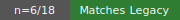

# Counterpoint Contraction Fraction Sweep Diagnostics





This repository directory is the human-readable readout surface for the counterpoint n-over-18 contraction fraction sweep diagnostic.

## Status At A Glance

- Artifact evidence: complete.
- Sweep verdict: immediate collapse.
- First full-collapse numerator: `1`.
- First near-collapse numerator: `1`.
- Last nontrivial numerator: `none observed`.
- Legacy endpoint check for `6/18`: `True`.
- Concrete steps emitted across this artifact run: `21`.
- Claim scope: diagnostic only; this is not a learning-performance comparison.

## One-Screen Verdict

The smoke run completed and produced the required machine-readable summary tables.

On this smoke run, `1/18` is the first observed full-collapse numerator. When that value is `1/18`, the current single-block source-local fraction semantics are already severe at the weakest requested fraction.

`6/18` matches the legacy one-third first scheduled block in the generated equivalence table, so the sweep endpoint is comparable to the old one-third diagnostic for this run configuration.

## Source Evaluation Root

```text
<repo-root>/docs/evaluations/counterpoint_symbolic_v001/contraction_fraction_sweep_diagnostics/artifacts/smoke_001/evaluations/counterpoint_contraction_fraction_sweep_diagnostics_v001
```

## Summary of Goals Behind this Evaluation

This evaluation keeps the existing `counterpoint_symbolic_v001` environment fixed and varies only the scheduled contraction fraction. It asks whether small `n/18` fractions preserve meaningful first-tier structure before higher fractions collapse.

A smoke-scoped artifact run is implementation evidence only. A full-validation artifact run can support broader structural diagnostic claims, but still cannot support learning-performance claims without a separate comparison evaluation.

## Summary of Methodology Behind this Evaluation

For each configured arm, BBB selects one source-local scheduled outgoing-edge block using `max(1, ceil(out_degree * n / 18))`. Remaining edges are unscheduled for that arm. The tower is then built through the existing `state_collapser` partition tower path and exercised through the existing active-tier controller runtime.

This smoke run used instances `counterpoint_symbolic_n3_small_v001`, schema seeds `0`, numerators `1`, `6`, denominator `18`, replicates `1`, and episodes `1`.

## Tier Shape Table

| Arm | Tier | State Cells | Active Action Cells | Raw Historical Action Records | Largest Cell Share | Class |
| --- | ---: | ---: | ---: | ---: | ---: | --- |
| no_contraction_control | 0 | 108 | 1140 | 1140 | 0.009 | identity_or_base |
| n01_over_18 | 0 | 108 | 1140 | 1140 | 0.009 | identity_or_base |
| n01_over_18 | 1 | 1 | 0 | 1532 | 1.000 | full_collapse |
| n06_over_18 | 0 | 108 | 1140 | 1140 | 0.009 | identity_or_base |
| n06_over_18 | 1 | 1 | 0 | 17147 | 1.000 | full_collapse |

The tier table intentionally separates active action-cell count from raw historical action-cell record count. A collapsed tier can have zero live executable action cells while retaining many raw historical records from tower construction; the raw count is not the live control surface.

## Schema Width Table

| Arm | Scheduled Edges | Edge Share | Edges/(States-1) | Monotone |
| --- | ---: | ---: | ---: | --- |
| no_contraction_control | 0 | 0.000 | 0.0 |  |
| n01_over_18 | 112 | 0.098 | 1.0467289719626167 | True |
| n06_over_18 | 408 | 0.358 | 3.8130841121495327 | True |

## Threshold Table

| Instance | Schema Seed | First Full Collapse n | First Near Collapse n | Last Nontrivial n | n06 Matches Legacy | Verdict |
| --- | ---: | ---: | ---: | ---: | --- | --- |
| counterpoint_symbolic_n3_small_v001 | 0 | 1 | 1 | none | True | immediate_collapse |

## Endpoint-Coalescence Table

| Arm | Processed Edges | Useful Coalescences | Redundant/Internal Edges | State Cells After Block | First Singleton Edge Index | Collapse Used Most Block |
| --- | ---: | ---: | ---: | ---: | ---: | --- |
| no_contraction_control | 0 | 0 | 0 | 108 | none |  |
| n01_over_18 | 112 | 107 | 5 | 1 | 112 | True |
| n06_over_18 | 408 | 107 | 301 | 1 | 405 | True |

## Files

- [readout_source.json](readout_source.json): source binding from this repo readout surface to raw artifact tables.
- [method.md](method.md): methodology and budget summary.
- [runbook.md](runbook.md): rerun, summarize, and human-readout commands.
- [artifact_index.md](artifact_index.md): evidence map with file purposes.
- [glossary.md](glossary.md): field and mechanism translations.
- [results/summary.md](results/summary.md): compact reader-facing result summary.
- [results/sweep_verdict.md](results/sweep_verdict.md): sweep verdict details.
- [results/threshold_table.md](results/threshold_table.md): threshold table.

## Claim Boundary

This readout may claim that the smoke run completed, produced repo-resident artifacts, checked `6/18` against the old first one-third block, and reported the collapse threshold fields shown above.

This readout may not claim tower learning advantage, direct-vs-tower comparison, musical quality, tensor-enabled runtime behavior, CUDA/GPU behavior, production performance, or that the counterpoint environment is degenerate.

To regenerate the human-readable readout, run:

```text
execute docs/prime_directive/artifact_table_to_readable_document_protocol.md at <repo-root>/docs/evaluations/counterpoint_symbolic_v001/contraction_fraction_sweep_diagnostics/readout_source.json
```

## Clarifying Questions And Turns

#### Project Owner / Evaluator Turn

> Tell me as much as you can about this $1/18$ collapse.

#### Embedded Engineering Consultant / Codex Turn

> The most important thing is that `1/18` is not "one eighteenth of the whole graph" in the intuitive global sense. Under this evaluation's source-local quota rule, every source state with outgoing edges contributes at least one scheduled outgoing edge:
>
> ```text
> max(1, ceil(out_degree * n / 18))
> ```
>
> In this small fixture, that means `n01_over_18` schedules `112` edges out of `1140` total base edges, for an edge share of about `0.098`. The scheduled set is still source-covering: all `108` source states have at least one scheduled edge, with minimum selected edges per source `1`, mean about `1.037`, and maximum `2`. So the weak-looking fraction is actually a one-edge-or-more constraint from every source state.
>
> The endpoint-coalescence table explains the collapse mechanically. For `n01_over_18`, the scheduled block processed `112` edges. Of those, `107` were useful coalescences and `5` were redundant/internal by the time they were processed. Since the base has `108` states, `107` useful coalescences is exactly enough to merge all base states into one state cell under repeated endpoint coalescence. The table also says the first singleton state cell appears at processed edge index `112`, and `collapse_required_most_of_block=True`. That matters: this was not a collapse caused by the first few edges. The whole scheduled block was needed, and by the end it had supplied enough endpoint identifications to bind the entire base state set.
>
> The tier-shape table is the visible result:
>
> ```text
> base tier:      108 state cells, 1140 active action cells
> n01 tier 1:       1 state cell,     0 active action cells
> ```
>
> The raw historical action-cell record count at the collapsed tier is `1532`, but the active action-cell count is `0`. That is the distinction we added because it is easy to misread the raw records as live executable structure. They are not. At tier 1, the quotient shape exists historically, but the live control surface has no active executable action cells.
>
> My current interpretation is: the collapse is probably not "1/18 is already a large fraction" by itself. It is more specifically that the `max(1, ...)` per-source floor creates a source-covering scheduled block. In a graph with 108 states, one selected outgoing edge from essentially every state can easily behave like a spanning binding mechanism under endpoint-coalescence semantics. The total edge share is under ten percent, but the source coverage is one hundred percent, and source coverage is probably the more important structural variable here.
>
> That suggests the next diagnostic question is not only "what happens for smaller fractions?" because the current quota rule has no smaller nonzero source-local behavior than one scheduled edge per source. The sharper questions are:
>
> - What happens if the quota rule is global edge-budgeted instead of source-local floor-budgeted?
> - What happens if some sources are allowed to contribute zero scheduled edges?
> - Is collapse driven mostly by source coverage, by particular high-bridge edges, or by the counterpoint transition graph's endpoint geometry?
> - Does the same immediate collapse happen for the medium fixture at `1/18`, or is this small-fixture-specific?
>
> So I would treat this smoke result as a strong warning about the contraction-selection semantics. It does not yet prove that every low-fraction schedule collapses counterpoint. It proves that this particular source-local floor rule, even at `1/18`, is strong enough to bind the whole small fixture in one scheduled block.

#### Project Owner / Evaluator Turn

> How difficult is it to modify this so that it's more noisy than a ceiling function? That would let us take the ratio way lower... like $1/36$ meaning like a distribution wiht mean $1/36$, but that often samples no arrows. I believe we've set contraction schemata up so that this would be simple to implement, but I dont know how different it would be from the details of the $1/18$ evaluation.

#### Embedded Engineering Consultant / Codex Turn

> I think your instinct is basically right: the contraction-schema side should be fairly simple, because the current implementation already isolates selection into a small set of surfaces. But it is not just "change 18 to 36." The current collapse is caused by the source-local ceiling-and-floor rule:
>
> ```text
> max(1, ceil(out_degree * n / denominator))
> ```
>
> That rule guarantees every source with outgoing edges contributes at least one scheduled edge. A noisy-rate rule would deliberately remove that guarantee. The cleanest version would be something like independent seeded Bernoulli selection over candidate outgoing edges:
>
> ```text
> select each outgoing edge with probability numerator / denominator
> ```
>
> Under a `1/36` Bernoulli rule, a source with out-degree `10` would have expected selected count `10/36`, but probability of selecting no edge:
>
> ```text
> (35/36)^10 ~= 0.754
> ```
>
> So most sources would contribute zero scheduled edges. That is exactly the behavior we cannot express with the current source-local quota floor. It would let us ask whether collapse was driven by the mere existence of a source-covering scheduled block.
>
> Implementation difficulty: small-to-moderate. I would not want to mutate the current fraction-sweep semantics in place, because this readout and its artifacts now mean "source-local ceil floor." I would add a sibling schema/evaluation mode, probably with a name like `counterpoint_noisy_rate_contraction_diagnostics_v001` or `counterpoint_bernoulli_rate_contraction_diagnostics_v001`.
>
> The likely code changes are contained:
>
> - Add a shared metadata helper parallel to `source_local_fraction_selections`, but with Bernoulli/random-rate selection and no minimum-one floor.
> - Add a runtime `ContractionSchema` parallel to `CounterpointOutgoingFractionSchema`, where `assign_edge()` returns the single scheduled block if the edge's seeded Bernoulli draw passes.
> - Add summary fields that make the new semantics legible: selected edge count, selected edge share, source count with at least one selected edge, zero-selected-source count, selected-source share, and maybe selected-source out-degree distribution.
> - Reuse most of the existing runner/aggregation/readout machinery, because tower construction, active action-cell counting, endpoint-coalescence diagnostics, concrete-step recording, and README generation are already shaped correctly.
> - Add tests for determinism, approximate expected rate on fixed fixtures, allowed zero-selection sources, and no accidental source-local floor.
>
> The main design choice is the sampling unit. I see three plausible options:
>
> - Edge Bernoulli: every edge independently selected with probability `p`. This is simplest and directly expresses "mean `1/36`."
> - Source-local binomial: each source samples `Binomial(out_degree, p)` edges, then takes that many shuffled outgoing edges. This gives the same count distribution per source, but preserves the current stable shuffled-prefix style.
> - Poisson count per source: sample `Poisson(out_degree * p)` then cap by out-degree. This is noisier and maybe mathematically attractive, but adds another distributional assumption.
>
> I would probably choose source-local binomial for continuity with this evaluation: it keeps the per-source deterministic shuffle, removes only the minimum-one floor, and gives us easy source-level summaries. Edge Bernoulli is also fine, and arguably even clearer. I would avoid Poisson first unless we specifically want that model.
>
> How different from the `1/18` evaluation? The runtime and artifact pipeline can be mostly reused; the interpretation changes a lot. The current evaluation sweeps deterministic source-covering quotas. The noisy-rate evaluation would sweep expected rates and explicitly measure source coverage as an outcome. The central question would become:
>
> ```text
> At what expected edge rate, and at what realized source coverage, does endpoint coalescence begin to collapse the tower?
> ```
>
> That is probably the next right diagnostic. It directly tests the hypothesis that `1/18` collapsed because it was source-covering, not because ten percent of edges is inherently too many.

#### Project Owner / Evaluator Turn

> Ok. Create the folder for the new evaluation, and copy this conversation over there.

#### Embedded Engineering Consultant / Codex Turn

> Created `docs/design/system_learning_from_evaluations/counterpoint_noisy_rate_contraction_diagnostics/` as the design-side home for the proposed noisy-rate follow-up evaluation. I copied the motivating readout conversation into `01_fraction_sweep_readout_conversation_archive.md` and added a local `README.md` that records the current status as design conversation only: no blueprint, no workplan, no implementation, and no artifacts yet.
>
> I also added the folder to the system-learning index so future LLM/engineer passes can detect it by the phrases `noisy-rate contraction`, `Bernoulli edge selection`, and `zero-selected sources`.
