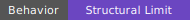
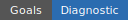

# Counterpoint First Serious Learning Evaluation Readout






## Status At A Glance

- Artifact evidence: partial; required result tables exist and were readable,
  but expected evaluation manifests and promoted tower summary tables are
  absent.
- Behavioral result: structural-limit diagnostic; direct and empty-schema arms
  execute real 8-step episodes, while non-empty tower arms are dominated by
  full or near-full first-projection collapse and schema-dependent
  lift/action-realization behavior.
- Goal result: diagnostic; the run validates the serious harness and exposes a
  quotient-collapse/lift-realization limit, but it blocks ordinary
  tower-performance and environment-non-performance claims.
- Claim scope: fixture-only; claims apply only to
  `counterpoint_symbolic_n3_small_v001`, the locked budget,
  `tensor_available_disabled`, and this artifact set.
- Provenance: repo-resident artifact root; the evidence is source-bound from
  this repo readout surface.

This repository directory is the human-readable readout surface for the
counterpoint first serious learning evaluation.

Source evaluation root:

```text
/Users/foster/big_boy_benchmarking/docs/evaluations/counterpoint_symbolic_v001/first_serious_learning/artifacts/pi0_h_evaluation_001/evaluations/counterpoint_first_serious_learning_v001
```

Source binding:

```text
readout_source.json
```

To regenerate this repo-side readout, execute the protocol against this
directory's checked-in source binding, not the README, raw artifact root, or raw
evaluation root:

```text
execute docs/prime_directive/artifact_table_to_readable_document_protocol.md at /Users/foster/big_boy_benchmarking/docs/evaluations/counterpoint_symbolic_v001/first_serious_learning/readout_source.json
```

Protocol applied:

```text
docs/prime_directive/artifact_table_to_readable_document_protocol.md
```

Prior clarifying-turn work for the earlier generated readout has been preserved
under:

```text
docs/design/system_learning_from_evaluations/counterpoint_first_serious_learning_v001/
```

## Summary of Goals Behind this Evaluation

This evaluation asks whether the first real counterpoint benchmark can support a
meaningful comparison between direct learning on the concrete symbolic graph and
tower-control learning through contraction schemas.

The environment is `counterpoint_symbolic_n3_small_v001`, a benchmark-owned
finite symbolic hidden graph. The goal is not to generate beautiful music. The
goal is to compare learning/control behavior under a fixed legality contract,
reward bundle, action-mask policy, seed/budget discipline, and artifact
contract.

The key baselines are direct tabular Q and the empty-schema tower. Direct
tabular Q is the primary concrete-environment learner baseline. The empty-schema
tower checks whether the tower runtime and active-tier control path work when no
nontrivial contraction is present. The non-empty tower arms then test whether
random, structured motion, and intentionally bad contraction schemas can realize
valid concrete actions and support learning through the tower interface.

This readout is a diagnostic learning/control evaluation. It is not a
musical-quality report, tensor-enabled performance result, CUDA/GPU result,
production performance result, or general claim that towers are better or worse
than direct learning.

## Summary of Methodology Behind this Evaluation

This readout summarizes a locked serious-run artifact set followed by
aggregation and human readout generation. The source binding points at a
repo-resident artifact root under this evaluation readout surface.

The evaluation compares direct environment arms against active-tier
exploit/explore tower-control arms under shared seed, budget, mask, artifact,
timing, and linearization discipline. The direct arms are `direct_masked_random`
and `direct_tabular_q`. The tower arms are the empty-schema tower, random
balanced and unbalanced contraction towers, structured motion tower, and
bad/adversarial tower.

The budget lock records `counterpoint_symbolic_n3_small_v001`,
`tensor_available_disabled`, 16 episodes per run, 4 replicates, 3 random schema
seeds, and a max horizon of 8 steps per episode. The aggregate tables summarize
returns, confidence intervals, baseline deltas, learning curves, timing
categories, controller events, schema diagnostics, and per-run lift/action
realization evidence.

The methodology can support artifact-completion, behavioral-status, and
diagnostic claims for this fixture and budget. It cannot support tensor-enabled,
CUDA/GPU, musical-quality, production-performance, or general tower-superiority
claims.

## One-Screen Verdict

All seven required arms produced machine-readable artifacts, and all `44` run
rows are marked `success`. That means the harness ran and wrote the expected
evaluation tables. It does not, by itself, mean every arm behaved equally well.

The direct baselines and empty-schema tower executed 8-step episodes with 100%
episode success and mean returns around `12.7`. Structured-motion and
bad/adversarial tower arms also execute 8-step episodes, but they do so under
fully collapsed first projections; their returns are diagnostic evidence about
the collapsed schema/runtime condition, not evidence of useful tower control.

The random tower arms are schema-seed dependent structural diagnostics. Random
balanced succeeds only on schema seed `2`; seeds `0` and `1` produce zero-step
episodes with `no_lift_candidate_from_current_state`. Random unbalanced
succeeds on schema seeds `0` and `2`; seed `1` produces the same zero-step
failure. This yields mean returns of `4.237` for random balanced and `8.473`
for random unbalanced, not because those arms partially learn within each run,
but because some schema seeds execute and others do not.

This run does not support a positive tower-performance claim, and it should not
be summarized as ordinary mixed non-performance. It supports a structural-limit
claim: broad/full-graph contraction schemas over this fixture can collapse the
first quotient projection so aggressively that learner-performance language is
blocked unless the evaluation explicitly controls for that collapse.

## Files

- [readout_source.json](readout_source.json): source binding from this repo readout surface to the raw artifact tables.
- [result_readout.md](result_readout.md): full human readout.
- [glossary.md](glossary.md): field and arm translations.
- [runbook.md](runbook.md): reconstructed commands and rerun notes.
- [artifact_index.md](artifact_index.md): evidence map with file purposes.
- [results/summary.md](results/summary.md): compact reader-facing result summary.
- [results/human_summary.md](results/human_summary.md): short result summary.
- [results/arm_readout_table.md](results/arm_readout_table.md): reader-facing arm table.
- [results/diagnostic_findings.md](results/diagnostic_findings.md): structural-limit and lift/action-realization diagnostics.
- [results/timing_readout.md](results/timing_readout.md): timing summary with category boundaries.

## Claim Boundary

This readout may claim:

- the locked serious-learning run completed all required arms;
- all required aggregate/result tables exist and parse;
- the direct baselines and empty-schema tower executed 8-step episodes with
  100% episode success;
- the random balanced and random unbalanced tower arms are schema-seed
  dependent under this budget;
- failing random-schema runs show `no_lift_candidate_from_current_state`;
- non-empty tower behavior in this artifact set is dominated by full or
  near-full first-projection quotient collapse and lift/action-realization
  effects.

This readout may not claim:

- tensor-enabled performance;
- CUDA or GPU performance;
- general tower superiority or inferiority;
- structured-motion advantage over the empty-schema tower;
- that the bad/adversarial arm is currently a useful negative control;
- ordinary learner-performance conclusions for non-empty tower arms without
  controlling for first-projection collapse;
- musical quality;
- production performance;
- a result beyond `counterpoint_symbolic_n3_small_v001`;
- a result beyond the recorded budget and seed policy.

## Evidence Status

Required machine-readable result files exist and parse:

- `evaluation_budget_lock.json`
- `evaluation_run_index.csv`
- `evaluation_aggregate_summary.json`
- `evaluation_aggregate_table.csv`
- `results/learning_curves.csv`
- `results/timing_summary.csv`
- `results/controller_summary.csv`
- `results/schema_diagnostic_summary.csv`

Expected files that are still absent or not promoted:

| File | Classification | Interpretation |
| --- | --- | --- |
| `evaluation_manifest.json` | `expected_missing_gap` | Expected evaluation-level provenance is absent. |
| `evaluation_arm_manifest.json` | `expected_missing_gap` | Expected arm-contract provenance is absent. |
| `results/tower_shape_summary.csv` | `expected_missing_gap` | Tower shape is reconstructed from per-run `quotient_summary.json`; it is not yet promoted as an evaluation-level table. |
| `results/tier_occupancy_summary.csv` | `expected_missing_gap` | Active-tier occupancy is reconstructable from per-run event files but not promoted. |
| `results/lift_failure_by_tier.csv` | `expected_missing_gap` | Lift/action-realization failure detail is reconstructable from per-run files but not promoted. |
| `calibration_summary.json` | `conditional_absent` | Calibration-path file; not necessarily expected for this locked serious run. |
| `calibration_run_index.csv` | `conditional_absent` | Calibration-path file; not necessarily expected for this locked serious run. |
| `calibration_recommendation.md` | `conditional_absent` | Calibration-path file; not necessarily expected for this locked serious run. |

The aggregate, run index, budget lock, learning curves, timing summary,
controller summary, schema diagnostic summary, and per-run diagnostic files were
available and used for this readout.

## Clarifying Questions And Turns

#### Project Owner / Evaluator Turn

> ...

#### Embedded Engineering Consultant / Codex Turn

> ...

#### Project Owner / Evaluator Turn

> ...

#### Embedded Engineering Consultant / Codex Turn

> ...

#### Project Owner / Evaluator Turn

> ...

#### Embedded Engineering Consultant / Codex Turn

> ...
