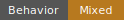
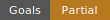

# Counterpoint First Serious Learning Evaluation Readout






## Status At A Glance

- Artifact evidence: partial; required result tables exist and were readable,
  but expected evaluation and arm manifests are absent.
- Behavioral result: mixed; direct, empty-schema, structured-motion, and
  bad/adversarial arms execute real 8-step episodes, while random balanced and
  random unbalanced arms are schema-seed dependent and include zero-step
  failures.
- Goal result: partially met; the run validates the serious harness and several
  tower-control paths, but it does not show tower advantage and leaves
  random-schema lift candidates plus the bad-control interpretation unresolved.
- Claim scope: fixture-only; claims apply only to
  `counterpoint_symbolic_n3_small_v001`, the locked budget,
  `tensor_available_disabled`, and this artifact set.
- Provenance: repo-resident artifact root; the evidence is source-bound from
  this repo readout surface.

This repository directory is the human-readable readout surface for the
counterpoint first serious learning evaluation.

Source evaluation root:

```text
/Users/foster/big_boy_benchmarking/docs/evaluations/counterpoint_symbolic_v001/first_serious_learning/artifacts/v071_002_clean/evaluations/counterpoint_first_serious_learning_v001
```

Source binding:

```text
readout_source.json
```

To regenerate this repo-side readout, point the protocol at this directory, not
at the raw artifact root:

```text
execute artifact-table readout pointed at folder /Users/foster/big_boy_benchmarking/docs/evaluations/counterpoint_symbolic_v001/first_serious_learning
```

Protocol applied:

```text
docs/prime_directive/artifact_table_to_readable_document_protocol.md
```

## Summary of Goals Behind this Evaluation

This evaluation asks whether the first real counterpoint benchmark can support a
meaningful comparison between direct learning on the concrete symbolic graph and
tower-control learning through contraction schemas.

The environment is `counterpoint_symbolic_n3_small_v001`, a benchmark-owned
finite symbolic hidden graph. The goal is not to generate beautiful music. The
goal is to compare learning/control behavior under a fixed legality contract,
reward bundle, action-mask policy, seed/budget discipline, and artifact
contract.

The key baselines are direct tabular Q and the empty-schema tower. Direct
tabular Q is the primary concrete-environment learner baseline. The empty-schema
tower checks whether the tower runtime and active-tier control path work when no
nontrivial contraction is present. The non-empty tower arms then test whether
random, structured motion, and intentionally bad contraction schemas can realize
valid concrete actions and support learning through the tower interface.

This readout is therefore a diagnostic learning/control evaluation, not a
musical-quality report, tensor-enabled performance result, CUDA/GPU result,
production performance result, or general claim that towers are better or worse
than direct learning.

## Summary of Methodology Behind this Evaluation

This readout summarizes a locked serious-run artifact set followed by
aggregation and human readout generation. The source binding points at a
repo-resident artifact root under this evaluation readout surface.

The evaluation compares direct environment arms against active-tier
exploit/explore tower-control arms under shared seed, budget, mask, artifact,
timing, and linearization discipline. The direct arms are `direct_masked_random`
and `direct_tabular_q`. The tower arms are the empty-schema tower, random
balanced and unbalanced contraction towers, structured motion tower, and
bad/adversarial tower.

The budget lock records `counterpoint_symbolic_n3_small_v001`,
`tensor_available_disabled`, 16 episodes per run, 4 replicates, 3 random schema
seeds, and a max horizon of 8 steps per episode. The aggregate tables summarize
returns, confidence intervals, baseline deltas, learning curves, timing
categories, controller events, schema diagnostics, and per-run lift/action
realization evidence.

The methodology can support artifact-completion, behavioral-status, and
diagnostic claims for this fixture and budget. It cannot support tensor-enabled,
CUDA/GPU, musical-quality, production-performance, or general tower-superiority
claims.

## One-Screen Verdict

All seven required arms produced machine-readable artifacts, and all `44` run
rows are marked `success`. That means the harness ran and wrote the expected
evaluation tables. It does not, by itself, mean every arm behaved equally well.

The direct baselines, empty-schema tower, structured-motion tower, and
bad/adversarial tower all executed 8-step episodes with 100% episode success
and mean returns around `12.7`.

The random tower arms are schema-seed dependent. Random balanced succeeds only
on schema seed `2`; seeds `0` and `1` produce zero-step episodes with
`no_lift_candidate_from_current_state`. Random unbalanced succeeds on schema
seeds `0` and `2`; seed `1` produces the same zero-step failure. This yields
mean returns of `4.237` for random balanced and `8.473` for random unbalanced,
not because those arms partially learn within each run, but because some schema
seeds execute and others do not.

This run does not support a positive tower-performance claim. Structured motion
matches the empty-schema tower rather than beating it, random schemas remain
brittle, and the bad/adversarial control does not degrade under this budget.

## Files

- [readout_source.json](readout_source.json): source binding from this repo readout surface to the raw artifact tables.
- [result_readout.md](result_readout.md): full human readout.
- [glossary.md](glossary.md): field and arm translations.
- [runbook.md](runbook.md): reconstructed commands and rerun notes.
- [artifact_index.md](artifact_index.md): evidence map with file purposes.
- [results/summary.md](results/summary.md): compact reader-facing result summary.
- [results/human_summary.md](results/human_summary.md): short result summary.
- [results/arm_readout_table.md](results/arm_readout_table.md): reader-facing arm table.
- [results/diagnostic_findings.md](results/diagnostic_findings.md): behavioral failure analysis.
- [results/timing_readout.md](results/timing_readout.md): timing summary with category boundaries.

## Claim Boundary

This readout is limited to `counterpoint_symbolic_n3_small_v001` under
`tensor_available_disabled`. Tensor execution was disabled. This is not a CUDA,
GPU, tensor-enabled, musical-quality, general superiority, or production
performance result.

This readout may claim:

- the locked serious-learning run completed all required arms and wrote the
  required aggregate/result tables;
- direct baselines, empty-schema tower, structured-motion tower, and
  bad/adversarial tower execute real concrete environment steps under this
  budget;
- random balanced and random unbalanced tower arms are schema-seed dependent
  and can produce zero-step episodes through
  `no_lift_candidate_from_current_state`.

This readout may not claim:

- tower-control superiority over direct learning;
- structured-motion advantage over the empty-schema tower;
- that the bad/adversarial schema is currently a healthy negative control;
- tensor-enabled, GPU, CUDA, musical-quality, production, or general
  state-collapser performance.

## Provenance Status

The source binding for this readout is `readout_source.json`. It identifies the
source artifact root, source evaluation root, source tables, environment
instance, linearization mode, claim boundary, goal-summary sources, and
expected-file policy.

Absent files are classified by expectation status:

| File | Classification | Expectation source | Interpretation |
| --- | --- | --- | --- |
| `evaluation_manifest.json` | `expected_missing_gap` | Serious evaluation artifact contract | Expected evaluation-level provenance is absent. |
| `evaluation_arm_manifest.json` | `expected_missing_gap` | Serious evaluation artifact contract | Expected arm-contract provenance is absent. |
| `calibration_summary.json` | `conditional_absent` | Calibration path contract | Expected for calibration, not necessarily for this locked serious run. |
| `calibration_run_index.csv` | `conditional_absent` | Calibration path contract | Expected for calibration, not necessarily for this locked serious run. |
| `calibration_recommendation.md` | `conditional_absent` | Calibration path contract | Expected for calibration, not necessarily for this locked serious run. |

The aggregate, run index, budget lock, learning curves, timing summary,
controller summary, schema diagnostic summary, and per-run diagnostic files were
available and used for this readout.

## Clarifying Questions And Turns

#### Project Owner / Evaluator Turn

> List the specific arms for me, and their corresponding result.

#### Embedded Engineering Consultant / Codex Turn

> Here are the seven arms in this evaluation and their corresponding current
> results from the clean `v071_002_clean` artifact set.
>
> | Arm | What it is | Result |
> | --- | --- | --- |
> | `direct_masked_random` | Direct environment masked-random baseline. | Succeeded. `64` episodes, mean return `12.790`, mean steps `8.0`, success rate `100%`. This is the non-learning floor, and it is slightly above direct tabular Q in this short budget. |
> | `direct_tabular_q` | Direct environment tabular Q-learning baseline. | Succeeded. `64` episodes, mean return `12.696`, mean steps `8.0`, success rate `100%`. This is the primary direct-learning baseline. |
> | `tower_empty_exploit_explore_tabular_q` | Tower controller with empty/no-op schema. | Succeeded. `64` episodes, mean return `12.710`, mean steps `8.0`, success rate `100%`. This shows the tower shell can execute when no nontrivial contraction is present. |
> | `tower_random_balanced_exploit_explore_tabular_q` | Tower controller with balanced random contraction schemas over seeds `0`, `1`, and `2`. | Mixed. `192` episodes, mean return `4.237`, mean steps `2.7`, success rate `33%`. Schema seed `2` executes successfully; schema seeds `0` and `1` produce zero-step episodes with `no_lift_candidate_from_current_state`. |
> | `tower_random_unbalanced_exploit_explore_tabular_q` | Tower controller with unbalanced random contraction schemas over seeds `0`, `1`, and `2`. | Mixed. `192` episodes, mean return `8.473`, mean steps `5.3`, success rate `67%`. Schema seeds `0` and `2` execute successfully; schema seed `1` produces zero-step episodes with `no_lift_candidate_from_current_state`. |
> | `tower_motion_exploit_explore_tabular_q` | Tower controller with the structured motion contraction schema. | Succeeded. `64` episodes, mean return `12.710`, mean steps `8.0`, success rate `100%`. It executes, but it matches the empty-schema tower rather than showing an advantage. |
> | `tower_bad_exploit_explore_tabular_q` | Tower controller with intentionally bad/adversarial contraction schema. | Succeeded. `64` episodes, mean return `12.710`, mean steps `8.0`, success rate `100%`. This is surprising as a negative control: under this budget it does not degrade relative to the empty-schema tower. |
>
> The shortest truthful summary is: direct baselines work; the empty tower
> works; structured motion executes but does not outperform the empty tower;
> random schemas are seed-sensitive; and the bad/adversarial control is not
> currently acting like a useful negative control.

#### Project Owner / Evaluator Turn

> Two questions:
>  1. Do we still have the ability to look at tower shape and how many steps spent on lower tiers in `state_collapser`. Before we did all its `synthetic_blow` revisions, we did have that ability, but I believe we lost *some* of that ability. PLease invstigate thoroughly and report.
>  2. Could the negative results we're getting here be attributable entirely to "exp/exp" logic we worked on in `state_collapser`? There should be a lot of information about this work in `engineer_continuity` reports in `state_collapser`. The really important thing here is that The specific aggregating operation used for direct image puts strong upperbounds on performance. For instance, if we used `max`, then an immediate implication is that a reward lifting criterion at each tier actually sets a total upperbound for the whole system. An `avg` aggregating funciton does a similar thing. This means that there's actually a kind of trade-off logic that every user/engineer has to think through here. Please to extensive inestigation in `state_collapser` and `big_boy_benchmarking` and report.

#### Embedded Engineering Consultant / Codex Turn

> I investigated this in both repos. The short answer is: yes, we still have
> the underlying ability to inspect tower shape and active-tier behavior, but
> you are right that we lost some of the easy, first-class, human-readable
> visibility after the `synthetic_blow` revisions. The loss is mostly in the
> automatic artifact/readout layer, not in the core `state_collapser` runtime.
>
> In current `state_collapser` `0.7.1`, the core structural queries still
> exist. `PartitionTower` exposes current tier positions, state-cell members,
> outgoing action cells, action-cell members, lift candidates, refinement
> fibers, and explicit compatibility readouts through
> `to_quotient_tier_views()`. `TowerRuntime` also exposes the live
> `partition_tower`, the last tower update result, and explicit/lazy
> compatibility readouts. The important `synthetic_blow` change is that these
> readouts are no longer forced through the default hot path. That is good for
> performance and source-of-truth discipline, but it means a benchmark has to
> deliberately export the shape it cares about.
>
> `state_collapser` also still has active-tier observability. The
> exploit/explore runtime owns `TierControlMetrics`, which records
> `active_tier_counts` and controller mode counts. The plate-support example
> training result still records `active_tiers_seen`. So the ability was not
> deleted. What is missing is that BBB is not yet promoting that information
> into evaluation-level tables in a way a human can immediately read.
>
> In this BBB evaluation, the raw artifacts are enough to reconstruct the
> story:
>
> - per-run `quotient_summary.json` includes `state_cell_count_by_tier`;
> - per-run `control_events.csv` includes `active_tier_before`,
>   `active_tier_after`, and `control_action`;
> - per-run `lift_fiber_events.csv` includes `active_tier`, success/failure,
>   candidate count, and failure reason;
> - per-run `step_events.csv` includes active tier before/after for successful
>   concrete environment steps.
>
> But the current aggregate tables flatten away some of the crucial detail.
> `results/schema_diagnostic_summary.csv` keeps only tier count and edge count,
> not the full `state_cell_count_by_tier`. `results/controller_summary.csv`
> counts controller actions but drops the active-tier breakdown. So the raw
> files contain the evidence, while the generated human surface is still too
> thin.
>
> I also summarized the clean `v071_002_clean` run directly from the raw event
> files. The important tier-shape/occupancy facts are:
>
> | Arm / schema seed | Tower shape from `state_cell_count_by_tier` | Active-tier behavior | Outcome |
> | --- | --- | --- | --- |
> | Empty schema | `(108,)` | All `512` concrete steps at tier `0`; controller actions all tier `0`. | Succeeds. |
> | Structured motion | `(108, 1, 1, 1, 1)` | All `512` concrete steps at tier `0`; deeper tiers are not used for action execution. | Succeeds, but behaves like empty tower. |
> | Bad/adversarial | `(108, 1)` | All `512` concrete steps at tier `0`; deeper tier is not used for action execution. | Succeeds, which weakens it as a negative control. |
> | Random balanced seed `0` | `(108, 3, 1, 1, 1)` | Descends from tier `0` to tier `1`; records `3072` tier-`1` explore events and `960` tier-`1` train events; no concrete steps. | Fails with `3072` `no_lift_candidate_from_current_state` lift failures at tier `1`. |
> | Random balanced seed `1` | `(108, 8, 2, 1, 1)` | Descends from tier `0` to tier `1`, then tier `2`; records `3008` tier-`2` explore events and `960` tier-`2` train events; no concrete steps. | Fails with `3008` `no_lift_candidate_from_current_state` lift failures at tier `2`. |
> | Random balanced seed `2` | `(108, 1, 1, 1, 1)` | All `512` concrete steps at tier `0`. | Succeeds. |
> | Random unbalanced seed `0` | `(108, 1, 1)` | All `512` concrete steps at tier `0`. | Succeeds. |
> | Random unbalanced seed `1` | `(108, 2, 1)` | Descends from tier `0` to tier `1`; records `3072` tier-`1` explore events and `960` tier-`1` train events; no concrete steps. | Fails with `3072` `no_lift_candidate_from_current_state` lift failures at tier `1`. |
> | Random unbalanced seed `2` | `(108, 1, 1)` | All `512` concrete steps at tier `0`. | Succeeds. |
>
> That gives a much sharper diagnosis than the top-level arm means. The random
> failures are not "weak learning after eight bad concrete steps." They are
> higher-indexed/coarser-tier action-realization failures. In the failing
> schema seeds, the controller reaches a tier with outgoing abstract action
> cells, but the selected action cell does not contain a concrete edge
> executable from the current base state. That is why the failure reason is now
> `no_lift_candidate_from_current_state`, not the old
> `invalid_action_index`.
>
> This also answers the "did we lose something?" question precisely. We did not
> lose the ability to inspect tower shape or tier occupancy. We did lose the
> habit/surface of always putting that information in the reader-facing
> benchmark summary. BBB should add at least three evaluation-level tables:
> `tower_shape_summary.csv`, `tier_occupancy_summary.csv`, and
> `lift_failure_by_tier.csv`. The human readout protocol should then render
> those tables near the top whenever a tower-control evaluation is involved.
>
> On the second question: no, I do not think the negative results in this run
> can be attributed entirely to exp/exp logic. Exp/exp is involved, but the
> current failures are an interaction among the controller, the contraction
> schema shape, and the lift/action-realization predicate.
>
> The upstream `state_collapser` continuity reports tell the right history.
> The first exploit/explore implementation was alive but behaviorally immature:
> one early observation was that active tiers stayed at `0`, so the deeper
> intended ABC behavior was not yet expressing itself. Then the degenerate-tier
> handoff work fixed a specific downstream failure: if a coarser active tier
> has zero outgoing action cells, the runtime should lift to a finer executable
> tier before asking the learner for an action. BBB now wires that
> `tier_is_executable` predicate through `ExploitExploreTowerRuntime`.
>
> The clean run shows that fix worked for the original bug class. The old
> failure was:
>
> ```text
> coarser active tier has zero outgoing action cells
>     -> learner returns -1
>     -> invalid_action_index
>     -> zero concrete steps
> ```
>
> The current failure is different:
>
> ```text
> coarser active tier has outgoing abstract action cells
>     -> learner chooses one
>     -> selected action cell has no concrete candidate from current base state
>     -> no_lift_candidate_from_current_state
>     -> zero concrete steps
> ```
>
> That matters. This is not "the exp/exp controller is just bad." It is more
> specifically: exp/exp sometimes descends into a coarser tier that passes the
> current upstream executable-tier predicate, but that tier is not actually
> executable under BBB's stricter counterpoint lift semantics. The
> `state_collapser` handoff note already anticipated this as an optional
> downstream stricter predicate: a counterpoint tier should perhaps be treated
> as executable only if at least one outgoing action cell has a legal concrete
> lift candidate from the current base state.
>
> On direct-image aggregation: your concern is real, but I do not think this
> particular run has actually exercised that issue as the main causal path yet.
> `state_collapser` has a real `RewardAggregator` surface with `sum`, `mean`,
> `max`, `softmax`, `p_mean`, `p_norm`, and custom modes. The synthetic-blow
> continuity docs also added a separate internal/preimage aggregation surface
> with `sum`, `mean`, and `max`. The log-tropical design docs explicitly record
> your point that max direct image is often more natural for RL because a coarse
> state may need to remember the best available downstream value rather than
> the average value of a fiber.
>
> BBB currently constructs the counterpoint partition tower with
> `RewardAggregator("mean")`. However, in the serious counterpoint tower runner
> the learner is not currently receiving a separately computed direct-image
> reward from the quotient fiber. The executor realizes a concrete
> counterpoint action, calls `evaluate_transition(...)`, and puts that realized
> concrete reward into `ActiveTierTransition.aggregated_reward`. I also checked
> the current `state_collapser` source: the reward aggregator is present and
> tested as a surface, but it is not yet the thing causing these random-schema
> zero-step failures. The failures happen before a concrete transition reward
> is available.
>
> So my best causal statement is:
>
> - The current negative/mixed results are primarily lift-realization and
>   active-tier executability results.
> - Exp/exp participates because it chooses when to descend, explore, train,
>   lift, or execute.
> - Direct-image aggregation semantics are not yet the measured cause of these
>   failures, because this runner trains on realized concrete rewards after a
>   lift succeeds.
> - Your aggregation trade-off is still essential for the next serious
>   benchmark layer, because once we train or choose at coarser quotient tiers
>   using actual direct-image reward/value summaries, `mean` versus `max`
>   versus soft/p-mean modes can change the effective ceiling and bias of the
>   abstract policy.
>
> The next design/implementation move I would recommend is not to declare tower
> learning bad or to tune Q-learning first. It is to add the missing
> observability and then run an explicit axis:
>
> 1. shape/occupancy readout: tower shape, active-tier occupancy,
>    lift-failure-by-tier, and successful concrete-step-by-tier;
> 2. stricter counterpoint executability predicate: "has an outgoing action
>    cell with at least one legal/current-state concrete lift candidate";
> 3. reward/value aggregation mode axis: at minimum `mean` versus `max`, with
>    the chosen aggregator recorded in manifests and surfaced in the README;
> 4. claim-boundary language that separates "action-realization failure" from
>    "reward-aggregation trade-off" from "learner underperformance."
>
> That would put us back in control of the evidence. Right now, the run is a
> good diagnostic action-realization benchmark. It is not yet a clean
> direct-image reward aggregation benchmark.

#### Project Owner / Evaluator Turn

> Change this in relevant protocols: "What is missing is that BBB is not yet promoting that information into evaluation-level tables in a way a human can immediately read." ...So let me make sure I'm alligned... So this `(108, 3, 1, 1, 1)` for instance means that at some point in the process, at total tier-$0$, we have 108 distinct states, but because of the quotienting operation particulars maybe, we have only three coset states at the next tier down, tier-$1$, and then degenerate tiers after that? Let's just start there. I have more follow-up questions, but I just want to make sure I'm reading this correctly.

#### Embedded Engineering Consultant / Codex Turn

> Yes, you are reading the tuple basically correctly, with one important
> convention correction.
>
> In this BBB/state_collapser runtime, tier index `0` is the fine/base tier.
> For this counterpoint fixture, `108` means there are `108` base state cells at
> tier `0`, which in this full-graph build corresponds to the reachable
> concrete counterpoint states for `counterpoint_symbolic_n3_small_v001`.
>
> The tuple `(108, 3, 1, 1, 1)` means:
>
> | Tier | State-cell count | Reading |
> | --- | ---: | --- |
> | `0` | `108` | Fine/base tier: one state cell per concrete reachable state. |
> | `1` | `3` | First coarsened quotient tier: the schema has collapsed those `108` concrete states into `3` state cells/cosets. |
> | `2` | `1` | Further coarsened tier: everything has collapsed into one state cell. |
> | `3` | `1` | Degenerate fully collapsed tier carried farther down the schema. |
> | `4` | `1` | Another degenerate fully collapsed tier. |
>
> So yes: for random balanced schema seed `0`, the first nontrivial quotient
> layer has `3` coarse state cells, and all later tiers are degenerate as state
> partitions.
>
> The phrase I would avoid is "at some point in the process." In this BBB run,
> the counterpoint partition tower is built from the enumerated reachable graph
> up front for the run/schema. So `(108, 3, 1, 1, 1)` is the tower shape for
> that run's schema, not a time series showing how shape changed episode by
> episode. The time-series part is separate: it comes from `control_events.csv`,
> `step_events.csv`, and `lift_fiber_events.csv`.
>
> The other important distinction is that "a tier exists" does not mean "the
> controller successfully used that tier for concrete action." For this same
> random balanced seed `0`, the tower shape has tiers `0..4`, but the
> controller mostly gets stuck at tier `1`: it descends from tier `0` to tier
> `1`, explores/trains there, and records `no_lift_candidate_from_current_state`
> failures without executing concrete environment steps. So the shape tuple
> tells us the quotient geometry; the event files tell us how the controller
> actually moved through that geometry.
>
> I also changed the relevant protocol docs to stop leaving this as implicit
> reconstruction work. The construction/readout protocols now say that
> tower-control evaluations must promote this into evaluation-level tables:
> `tower_shape_summary.csv`, `tier_occupancy_summary.csv`, and
> `lift_failure_by_tier.csv`. That is the protocol-level fix for the sentence
> you flagged.

#### Project Owner / Evaluator Turn

> Next questions:
>   1. Do I understand correctly that for this environment and evaluation, we are operating on a full tier-$0$ graph from the outset? If so, could these be a reason for *exp/exp* failure, since we designed exp/exp for a graph that requires discovery. I realize this is a long-shot, but I'd like an investigation and report.
>   2. Describe for me, for each of these arms, exactly what the contraction schema is, and why is results in such intense contraction $\text{pr}^{0}_{1}$.

#### Embedded Engineering Consultant / Codex Turn

> Yes: for the tower-control arms in this evaluation, we are operating on a
> full tier-`0` graph from the outset. More precisely, the counterpoint tower
> adapter enumerates the reachable graph for
> `counterpoint_symbolic_n3_small_v001`, converts all reachable states and all
> legal graph edges into `state_collapser` core objects, and calls
> `PartitionTower.initialize(...)` with the full state/edge set. For this
> fixture that means `108` concrete tier-`0` state cells and `1140` graph
> edges are available to the tower before episode control begins.
>
> The episode runner is still stepping concrete counterpoint episodes. But the
> tower topology is not being discovered online in this evaluation. This is an
> offline/full-graph tower-control benchmark, not the original discovery-first
> exp/exp setting.
>
> I think your long-shot hypothesis is real enough to keep on the board, with
> a careful boundary:
>
> - Full-graph initialization probably contributes to the extreme quotient
>   collapse. When all `1140` edges are available immediately, the first
>   contraction block can contain enough edges to connect almost the whole
>   tier-`0` graph.
> - Exp/exp was designed around an agent that discovers graph structure over
>   time. In that intended setting, lower/coarser tiers emerge from partial
>   discovered structure and active-tier control is supposed to respond to
>   changing evidence. Here the controller receives a fully built tower at
>   time zero.
> - That can make the controller descend into an already over-collapsed tier
>   before there is meaningful learned support for using that tier as an
>   action surface.
> - However, full-graph initialization is not by itself a sufficient
>   explanation for the failures. The empty tower, structured-motion tower,
>   bad/adversarial tower, random balanced seed `2`, and random unbalanced
>   seeds `0` and `2` are also full-graph tower runs and still execute concrete
>   steps. The failures happen only when the active tier has abstract outgoing
>   action cells but those cells do not contain a current-state concrete lift
>   candidate.
>
> So my current read is: full-graph initialization is a likely contributor to
> the pathological abstraction geometry, but the immediate behavioral failure
> is still the interaction of active-tier descent, coarse action cells, and
> current-state lift realizability.
>
> There is also an important schema-surface distinction. BBB has
> benchmark-owned schema manifests in
> `src/big_boy_benchmarking/environments/counterpoint/schemas.py`, but the
> tower shapes in this evaluation are controlled by the actual
> `state_collapser` runtime schema selected in
> `tower_adapter.contraction_schema_for_id(...)`. For explaining
> `(108, 3, 1, 1, 1)` and the other shapes, the runtime schema is the one that
> matters.
>
> Here are the arms and their actual contraction meaning in this run.
>
> | Arm | Runtime contraction schema | Resulting tower shape | Why `pr^0_1` is so intense |
> | --- | --- | --- | --- |
> | `direct_masked_random` | No tower schema. Direct concrete environment baseline. | Not applicable. | No quotient projection. |
> | `direct_tabular_q` | No tower schema. Direct concrete tabular-Q baseline. | Not applicable. | No quotient projection. |
> | `tower_empty_exploit_explore_tabular_q` | `NoContractionSchema()`. Every edge is unscheduled for contraction. | `(108,)` | There is no tier `1`, so no `pr^0_1` contraction. This is the tower shell baseline. |
> | `tower_random_balanced_exploit_explore_tabular_q`, seed `0` | `SeededRandomRateSchema(seed=0, block_count=4)`. Each edge is deterministically assigned to one of four random contraction blocks. | `(108, 3, 1, 1, 1)` | The first random block contains `266` of `1140` edges. Contracting those edges at tier `1` produces one giant component of `106` states plus two singleton cells. |
> | `tower_random_balanced_exploit_explore_tabular_q`, seed `1` | `SeededRandomRateSchema(seed=1, block_count=4)`. | `(108, 8, 2, 1, 1)` | The first random block contains `262` edges. That still yields one giant tier-`1` cell of `101` states plus seven singleton cells. The next block collapses those `8` cells down to `2`. |
> | `tower_random_balanced_exploit_explore_tabular_q`, seed `2` | `SeededRandomRateSchema(seed=2, block_count=4)`. | `(108, 1, 1, 1, 1)` | The first random block contains `291` edges and is already connected enough to collapse all `108` states into one tier-`1` cell. |
> | `tower_random_unbalanced_exploit_explore_tabular_q`, seed `0` | `SeededRandomRateSchema(seed=0, block_count=2)`. Despite the arm name, the runtime schema here is a two-block random edge schedule, not the manifest-side giant-cell partition. | `(108, 1, 1)` | The first block contains `544` edges, so it collapses all `108` states immediately. |
> | `tower_random_unbalanced_exploit_explore_tabular_q`, seed `1` | `SeededRandomRateSchema(seed=1, block_count=2)`. | `(108, 2, 1)` | The first block contains `558` edges and produces one giant tier-`1` cell of `107` states plus one singleton. |
> | `tower_random_unbalanced_exploit_explore_tabular_q`, seed `2` | `SeededRandomRateSchema(seed=2, block_count=2)`. | `(108, 1, 1)` | The first block contains `551` edges and collapses all `108` states immediately. |
> | `tower_motion_exploit_explore_tabular_q` | `DimensionwiseSchema(("counterpoint_transition", ("counterpoint_span_bucket", "compact"), ("counterpoint_span_bucket", "medium"), ("counterpoint_span_bucket", "wide")))`. | `(108, 1, 1, 1, 1)` | Every edge has the universal label `counterpoint_transition`, and `DimensionwiseSchema` assigns by the first matching dimension. So all `1140` edges enter the first block before the span-bucket blocks matter. Tier `1` collapses all states. |
> | `tower_bad_exploit_explore_tabular_q` | `DimensionwiseSchema(("counterpoint_transition",))`. | `(108, 1)` | This intentionally uses the universal transition label as a one-block contraction, so all `1140` edges are contracted at tier `1`. |
>
> The most important finding in that table is the structured-motion arm. Under
> the current runtime schema, "structured motion" is not really getting a
> first contraction by motion class. Because `counterpoint_transition` is first
> and universal, it catches every edge. That explains why structured motion
> behaves like an empty/base-tier execution path in the results: the coarser
> tiers exist, but the controller does not successfully use a meaningful
> motion quotient for better concrete action execution.
>
> The second important finding is the random-unbalanced arm. Its artifact
> schema description says "giant cell plus singletons," but its actual runtime
> contraction schema is currently just a two-block seeded random edge schedule.
> The name still captures that it is more aggressive/pathological than the
> four-block random balanced arm, but the implementation is not literally
> using the manifest-side giant-cell partition to build the tower.
>
> So the intense `pr^0_1` contraction comes from three overlapping causes:
>
> 1. The tower starts with the full reachable graph and all `1140` edges.
> 2. Partition-tower contraction merges source and target state cells along
>    every edge in the active contraction block, so a large or universal first
>    block becomes a connected-component collapse.
> 3. Several current schemas have first blocks that are huge: universal labels
>    for motion/bad, `~25%` of all edges for random balanced, and `~50%` of
>    all edges for random unbalanced.
>
> This makes the current evaluation excellent for exposing quotient/action-lift
> pathologies, but weak as evidence that exp/exp has been tested in its most
> natural online-discovery regime. A future comparison should probably include
> both modes explicitly: full-graph/offline tower control versus incremental
> discovery tower control.

#### Project Owner / Evaluator Turn

> Can you perform a more complete analysis here? "Full-graph initialization probably contributes to the extreme quotient collapse. When all 1140 edges are available immediately, the first contraction block can contain enough edges to connect almost the whole tier-0 graph." For instance, I want to better understand why a label-`"1"`, then label-`"2"`, and then label-`"3"` collapse would be pretty even for triadic counterpoint, but result in total collapse here. What is $n$, our number of voices, for these evaluations? Can you provide any kind of numerical or else system insight here?

#### Embedded Engineering Consultant / Codex Turn

> Yes. The voice count for this evaluation is `n = 3`. The active fixture is
> `counterpoint_symbolic_n3_small_v001`, with:
>
> - `voice_count = 3`;
> - pitch range `60..72`;
> - `measure_size = 4`;
> - horizon `8`;
> - `max_step_size = 2`;
> - raw simultaneous action lattice size `5^3 = 125`;
> - reachable tier-`0` state count `108`;
> - reachable edge count `1140`;
> - `27` reachable pitch triples at each beat phase, so `4 * 27 = 108`.
>
> The key system fact is this: the partition-tower contraction is not
> "divide states into three balanced buckets because there are three voices."
> It is edge-generated equivalence closure. If an edge belongs to a contraction
> block, the source and target state cells are merged. After all edges in that
> block are processed, tier `1` is essentially the connected components induced
> by that block's edges, treating those edges as equivalence-generating links.
>
> So the real question for `pr^0_1` is:
>
> ```text
> Does the first contraction block contain enough edges to connect most or all
> of the 108 tier-0 states?
> ```
>
> In this environment, the answer is often yes.
>
> Here is the useful numerical intuition. A random undirected graph on `108`
> nodes starts to become connected around the rough Erdos-Renyi scale
> `(n log n) / 2`, which is about `253` edges. That is only a heuristic because
> this graph is structured and directed before contraction, but it is
> surprisingly explanatory here. The random balanced first blocks contain
> `262`, `266`, or `291` edges depending on seed. That is right at or above the
> rough connectivity threshold. So even a "balanced" random edge block can
> create one giant connected component immediately.
>
> That is exactly what the observed tower shapes show:
>
> | First block | First-block edge count | Tier-`1` state cells | Tier-`1` largest cell sizes |
> | --- | ---: | ---: | --- |
> | Random balanced seed `0` | `266` | `3` | `106, 1, 1` |
> | Random balanced seed `1` | `262` | `8` | `101, 1, 1, 1, 1, 1, 1, 1` |
> | Random balanced seed `2` | `291` | `1` | `108` |
> | Random unbalanced seed `0` | `544` | `1` | `108` |
> | Random unbalanced seed `1` | `558` | `2` | `107, 1` |
> | Random unbalanced seed `2` | `551` | `1` | `108` |
> | Motion current runtime first block | `1140` | `1` | `108` |
> | Bad/adversarial first block | `1140` | `1` | `108` |
>
> This explains why full-graph initialization matters. If the tower were built
> incrementally from a small discovered subgraph, the first contraction block
> would initially contain only discovered edges. It could not instantly use all
> `262+` or `544+` edges to percolate through the full `108` states. In this
> evaluation, the whole reachable graph is present before control begins, so
> the first contraction block gets its full graph-connectivity power
> immediately.
>
> The "why would label `1`, then label `2`, then label `3` be even in
> triadic counterpoint?" intuition depends on what those labels mean. If the
> labels meant a clean coordinate quotient like "forget voice 1", "forget voice
> 2", "forget voice 3", or if they acted on explicit state coordinates rather
> than on dense transition edges, then we might expect something more even and
> interpretable. But our current runtime schema does not do that. It schedules
> transition edges into contraction blocks. In a simultaneous-action graph, a
> label attached to "voice 1 moves" can still include transitions where the
> other voices move too, so it can couple multiple pitch coordinates at once.
>
> I computed a few hypothetical label-block effects on the current `n = 3`
> graph:
>
> | Hypothetical first-block label | Edge count | Components after contraction | Largest components |
> | --- | ---: | ---: | --- |
> | all edges | `1140` | `1` | `108` |
> | target span bucket `medium` | `740` | `1` | `108` |
> | target span bucket `wide` | `400` | `9` | `100, 1, ..., 1` |
> | target span bucket `compact` | `0` | `108` | all singletons |
> | voice 1 moves, others may also move | `552` | `10` | `50, 50, 1, ..., 1` |
> | voice 2 moves, others may also move | `832` | `1` | `108` |
> | voice 3 moves, others may also move | `744` | `9` | `100, 1, ..., 1` |
> | only voice 1 moves | `32` | `84` | largest cells `4` |
> | only voice 2 moves | `176` | `16` | largest cell `24` |
> | only voice 3 moves | `96` | `50` | largest cells `12, 12` |
> | any voice moves up-step | `620` | `1` | `108` |
> | any voice moves down-step | `620` | `1` | `108` |
> | any voice is stationary | `772` | `1` | `108` |
>
> That table is the system insight. Coarse labels over simultaneous
> transitions are very powerful connectivity generators. They do not behave
> like clean per-voice state-coordinate projections unless the schema is built
> very carefully to enforce that interpretation.
>
> There is another counterpoint-specific fact: the reachable state set is small
> and regular. It has exactly `27` states per beat phase, and every legal edge
> moves from beat `b` to beat `b + 1 mod 4`. The stationary action alone
> connects each pitch triple across the four beat phases, producing `27`
> four-state components. Once pitch-changing labels are added, those beat-cycle
> components start joining each other. So a label block does not need anything
> close to all `1140` edges to create a giant component.
>
> Span labels show the same issue. There are no `compact` target-span edges in
> this reachable graph. The only target spans are `7`, `8`, `9`, and `12`.
> Target-span counts are:
>
> | Target span | Edge count | Bucket |
> | ---: | ---: | --- |
> | `7` | `264` | `medium` |
> | `8` | `476` | `medium` |
> | `9` | `240` | `wide` |
> | `12` | `160` | `wide` |
>
> So if a schema uses "medium" as its first real contraction block, it gets
> `740` edges and total collapse. "Wide" alone gets `400` edges and already
> creates a `100`-state giant component. There is no compact block available
> to give a smaller first quotient in this fixture.
>
> This also clarifies the structured-motion bug/pathology I noted earlier.
> The current runtime motion schema begins with the universal
> `counterpoint_transition` label, so its first block is not "motion class 1"
> or "span bucket medium." It is all `1140` edges. Total tier-`1` collapse is
> therefore guaranteed. Even if we removed that universal label and started
> with span buckets, `medium` would still totally collapse this graph, because
> `medium` alone already connects all `108` states.
>
> My current conclusion is:
>
> 1. `n = 3`, but the graph is not three weakly coupled one-voice graphs. It is
>    a simultaneous three-voice transition graph with strong legality coupling.
> 2. The first projection `pr^0_1` is intense because contraction follows edge
>    connectivity, not balanced state partitioning.
> 3. Full-graph initialization lets the first block see enough edges to
>    percolate across the whole reachable graph immediately.
> 4. Many natural-sounding labels are too coarse here. "Any medium span",
>    "voice 2 moves", "any up-step", "any down-step", or universal transition
>    labels all collapse the graph.
> 5. To get a more even triadic quotient, we probably need a more surgical
>    schema: exact motion-pattern blocks, single-voice-only blocks,
>    state-coordinate projections, edge blocks capped by connectivity
>    diagnostics, or an incremental/discovery-mode tower where blocks are not
>    allowed to percolate through the full graph at time zero.
>
> So your intuition is pointing at the right failure mode. The issue is not
> that triadic counterpoint cannot support an even quotient. The issue is that
> the current runtime contraction semantics plus full-graph edge availability
> make broad transition labels act like giant connected-component generators.

#### Project Owner / Evaluator Turn

> ...

#### Embedded Engineering Consultant / Codex Turn

> ...

#### Project Owner / Evaluator Turn

> ...

#### Embedded Engineering Consultant / Codex Turn

> ...

#### Project Owner / Evaluator Turn

> ...

#### Embedded Engineering Consultant / Codex Turn

> ...

#### Project Owner / Evaluator Turn

> ...

#### Embedded Engineering Consultant / Codex Turn

> ...

#### Project Owner / Evaluator Turn

> ...

#### Embedded Engineering Consultant / Codex Turn

> ...

#### Project Owner / Evaluator Turn

> ...

#### Embedded Engineering Consultant / Codex Turn

> ...

#### Project Owner / Evaluator Turn

> ...

#### Embedded Engineering Consultant / Codex Turn

> ...

#### Project Owner / Evaluator Turn

> ...

#### Embedded Engineering Consultant / Codex Turn

> ...

#### Project Owner / Evaluator Turn

> ...

#### Embedded Engineering Consultant / Codex Turn

> ...

#### Project Owner / Evaluator Turn

> ...

#### Embedded Engineering Consultant / Codex Turn

> ...

#### Project Owner / Evaluator Turn

> ...

#### Embedded Engineering Consultant / Codex Turn

> ...
