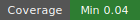
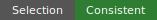

# Counterpoint Noisy-Rate Contraction Diagnostics






This repository directory is the human-readable readout surface for the counterpoint noisy-rate contraction diagnostic.

## Status At A Glance

- Artifact evidence: complete.
- Sweep verdict: no observed full collapse.
- First full-collapse requested rate: `none observed`.
- First near-collapse requested rate: `none observed`.
- Last nontrivial requested rate: `0.05555555555555555`.
- Minimum selected-source share across non-control arms: `0.037037037037037035`.
- Maximum zero-selected-source count in an arm: `108`.
- Metadata/runtime selected-edge consistency: `True`.
- Concrete steps emitted across this artifact run: `48`.
- Claim scope: diagnostic only; this is not a learning-performance comparison.

## One-Screen Verdict

The smoke run completed and produced the required machine-readable noisy-rate summary tables.

The key diagnostic distinction is expected edge rate versus realized source coverage. A low requested rate may select a small number of edges overall while leaving many source states with zero selected outgoing edges. That behavior is intentional here; it is the direct contrast with the earlier source-local floor rule.

On this smoke run, the observed sweep verdict is `no_collapse`.

## Source Evaluation Root

```text
/Users/foster/big_boy_benchmarking/docs/evaluations/counterpoint_symbolic_v001/noisy_rate_contraction_diagnostics/artifacts/smoke_001/evaluations/counterpoint_noisy_rate_contraction_diagnostics_v001
```

## Summary of Goals Behind this Evaluation

This evaluation keeps the existing `counterpoint_symbolic_v001` environment fixed and varies only the contraction selector. It asks whether an edge-global noisy expected-rate selector avoids the immediate-collapse behavior seen in the source-local fraction diagnostic.

A smoke-scoped artifact run is implementation evidence only. A full-validation artifact run can support broader structural diagnostic claims, but still cannot support learning-performance claims without a separate comparison evaluation.

## Summary of Methodology Behind this Evaluation

For each configured arm, BBB assigns every canonical counterpoint edge a stable SHA-256 score using the selector rule id, instance id, schema seed, and edge key. An edge is scheduled when that score is below the requested rate. No source-local minimum-one floor is used, so sources can contribute zero selected outgoing edges.

This smoke run used instances `counterpoint_symbolic_n3_small_v001`, schema seeds `0`, `1`, `2`, rates `1/144`, `1/36`, `1/18`, replicates `1`, and episodes `1`.

## Selection Table

| Arm | Requested Rate | Selected Edges | Edge Share | Expected Edges | Residual |
| --- | ---: | ---: | ---: | ---: | ---: |
| no_contraction_control | 0.00000 | 0 | 0.00000 | 0.00 | 0.00 |
| no_contraction_control | 0.00000 | 0 | 0.00000 | 0.00 | 0.00 |
| no_contraction_control | 0.00000 | 0 | 0.00000 | 0.00 | 0.00 |
| p001_over_144 | 0.00694 | 8 | 0.00702 | 7.92 | 0.08 |
| p001_over_144 | 0.00694 | 4 | 0.00351 | 7.92 | -3.92 |
| p001_over_144 | 0.00694 | 10 | 0.00877 | 7.92 | 2.08 |
| p001_over_036 | 0.02778 | 26 | 0.02281 | 31.67 | -5.67 |
| p001_over_036 | 0.02778 | 29 | 0.02544 | 31.67 | -2.67 |
| p001_over_036 | 0.02778 | 34 | 0.02982 | 31.67 | 2.33 |
| p001_over_018 | 0.05556 | 55 | 0.04825 | 63.33 | -8.33 |
| p001_over_018 | 0.05556 | 58 | 0.05088 | 63.33 | -5.33 |
| p001_over_018 | 0.05556 | 69 | 0.06053 | 63.33 | 5.67 |

## Source Coverage Table

| Arm | Rate | Selected Sources | Zero-Selected Sources | Selected Source Share | Class |
| --- | ---: | ---: | ---: | ---: | --- |
| no_contraction_control | 0.00000 | 0 | 108 | 0.000 | no_contraction_control |
| no_contraction_control | 0.00000 | 0 | 108 | 0.000 | no_contraction_control |
| no_contraction_control | 0.00000 | 0 | 108 | 0.000 | no_contraction_control |
| p001_over_144 | 0.00694 | 8 | 100 | 0.074 | partial_source_coverage |
| p001_over_144 | 0.00694 | 4 | 104 | 0.037 | partial_source_coverage |
| p001_over_144 | 0.00694 | 9 | 99 | 0.083 | partial_source_coverage |
| p001_over_036 | 0.02778 | 22 | 86 | 0.204 | partial_source_coverage |
| p001_over_036 | 0.02778 | 25 | 83 | 0.231 | partial_source_coverage |
| p001_over_036 | 0.02778 | 29 | 79 | 0.269 | partial_source_coverage |
| p001_over_018 | 0.05556 | 44 | 64 | 0.407 | partial_source_coverage |
| p001_over_018 | 0.05556 | 43 | 65 | 0.398 | partial_source_coverage |
| p001_over_018 | 0.05556 | 50 | 58 | 0.463 | partial_source_coverage |

## Tier Shape Table

| Arm | Rate | Tier | State Cells | Active Action Cells | Raw Historical Action Records | Largest Cell Share | Class |
| --- | ---: | ---: | ---: | ---: | ---: | ---: | --- |
| no_contraction_control | 0.00000 | 0 | 108 | 1140 | 1140 | 0.009 | identity_or_base |
| no_contraction_control | 0.00000 | 0 | 108 | 1140 | 1140 | 0.009 | identity_or_base |
| no_contraction_control | 0.00000 | 0 | 108 | 1140 | 1140 | 0.009 | identity_or_base |
| p001_over_144 | 0.00694 | 0 | 108 | 1140 | 1140 | 0.009 | identity_or_base |
| p001_over_144 | 0.00694 | 1 | 100 | 1132 | 1329 | 0.019 | compressed |
| p001_over_144 | 0.00694 | 0 | 108 | 1140 | 1140 | 0.009 | identity_or_base |
| p001_over_144 | 0.00694 | 1 | 104 | 1136 | 1233 | 0.019 | compressed |
| p001_over_144 | 0.00694 | 0 | 108 | 1140 | 1140 | 0.009 | identity_or_base |
| p001_over_144 | 0.00694 | 1 | 98 | 1130 | 1360 | 0.028 | compressed |
| p001_over_036 | 0.02778 | 0 | 108 | 1140 | 1140 | 0.009 | identity_or_base |
| p001_over_036 | 0.02778 | 1 | 82 | 1110 | 1878 | 0.046 | compressed |
| p001_over_036 | 0.02778 | 0 | 108 | 1140 | 1140 | 0.009 | identity_or_base |
| p001_over_036 | 0.02778 | 1 | 79 | 1090 | 2474 | 0.111 | compressed |
| p001_over_036 | 0.02778 | 0 | 108 | 1140 | 1140 | 0.009 | identity_or_base |
| p001_over_036 | 0.02778 | 1 | 75 | 1085 | 2330 | 0.102 | compressed |
| p001_over_018 | 0.05556 | 0 | 108 | 1140 | 1140 | 0.009 | identity_or_base |
| p001_over_018 | 0.05556 | 1 | 54 | 1029 | 3329 | 0.093 | compressed |
| p001_over_018 | 0.05556 | 0 | 108 | 1140 | 1140 | 0.009 | identity_or_base |
| p001_over_018 | 0.05556 | 1 | 53 | 870 | 5392 | 0.333 | compressed |
| p001_over_018 | 0.05556 | 0 | 108 | 1140 | 1140 | 0.009 | identity_or_base |
| p001_over_018 | 0.05556 | 1 | 43 | 777 | 5985 | 0.407 | compressed |

The tier table intentionally separates active action-cell count from raw historical action-cell record count. A collapsed tier can have zero live executable action cells while retaining many raw historical records from tower construction; the raw count is not the live control surface.

## Threshold Table

| Instance | Schema Seed | First Full Rate | First Near Rate | Last Nontrivial Rate | First High Coverage Rate | Verdict |
| --- | ---: | ---: | ---: | ---: | ---: | --- |
| counterpoint_symbolic_n3_small_v001 | 0 | none | none | 0.05555555555555555 | none | no_collapse |
| counterpoint_symbolic_n3_small_v001 | 1 | none | none | 0.05555555555555555 | none | no_collapse |
| counterpoint_symbolic_n3_small_v001 | 2 | none | none | 0.05555555555555555 | none | no_collapse |

## Endpoint-Coalescence Table

| Arm | Rate | Processed Edges | Useful Coalescences | State Cells After Block | Source Coverage | First Singleton Edge Index |
| --- | ---: | ---: | ---: | ---: | ---: | ---: |
| no_contraction_control | 0.00000 | 0 | 0 | 108 | 0.0 | none |
| no_contraction_control | 0.00000 | 0 | 0 | 108 | 0.0 | none |
| no_contraction_control | 0.00000 | 0 | 0 | 108 | 0.0 | none |
| p001_over_144 | 0.00694 | 8 | 8 | 100 | 0.07407407407407407 | none |
| p001_over_144 | 0.00694 | 4 | 4 | 104 | 0.037037037037037035 | none |
| p001_over_144 | 0.00694 | 10 | 10 | 98 | 0.08333333333333333 | none |
| p001_over_036 | 0.02778 | 26 | 26 | 82 | 0.2037037037037037 | none |
| p001_over_036 | 0.02778 | 29 | 29 | 79 | 0.23148148148148148 | none |
| p001_over_036 | 0.02778 | 34 | 33 | 75 | 0.26851851851851855 | none |
| p001_over_018 | 0.05556 | 55 | 54 | 54 | 0.4074074074074074 | none |
| p001_over_018 | 0.05556 | 58 | 55 | 53 | 0.39814814814814814 | none |
| p001_over_018 | 0.05556 | 69 | 65 | 43 | 0.46296296296296297 | none |

## Files

- [readout_source.json](readout_source.json): source binding from this repo readout surface to raw artifact tables.
- [method.md](method.md): methodology and budget summary.
- [runbook.md](runbook.md): rerun, summarize, and human-readout commands.
- [artifact_index.md](artifact_index.md): evidence map with file purposes.
- [glossary.md](glossary.md): field and mechanism translations.
- [results/summary.md](results/summary.md): compact reader-facing result summary.
- [results/noisy_rate_thresholds.md](results/noisy_rate_thresholds.md): threshold details.
- [results/source_coverage.md](results/source_coverage.md): source-coverage details.

## Claim Boundary

This readout may claim that the smoke run completed, produced repo-resident artifacts, checked metadata/runtime selected-edge consistency, reported source coverage, and reported collapse threshold fields shown above.

This readout may not claim tower learning advantage, direct-vs-tower comparison, musical quality, tensor-enabled runtime behavior, CUDA/GPU behavior, production performance, or that the counterpoint environment is degenerate.

To regenerate the human-readable readout, run:

```text
execute docs/prime_directive/artifact_table_to_readable_document_protocol.md at /Users/foster/big_boy_benchmarking/docs/evaluations/counterpoint_symbolic_v001/noisy_rate_contraction_diagnostics/readout_source.json
```

## Clarifying Questions And Turns

#### Project Owner / Evaluator Turn

> ...

#### Embedded Engineering Consultant / Codex Turn

> ...

#### Project Owner / Evaluator Turn

> ...

#### Embedded Engineering Consultant / Codex Turn

> ...

#### Project Owner / Evaluator Turn

> ...

#### Embedded Engineering Consultant / Codex Turn

> ...
