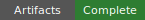
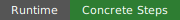
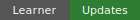

# Counterpoint Noisy-Rate Full-Tower Training Diagnostic








This repository directory is the human-readable readout surface for the counterpoint noisy-rate full-tower training health diagnostic.

## Status At A Glance

- Artifact evidence: `complete`.
- Candidate count: `7`.
- Concrete steps emitted: `222`.
- Successful learner updates: `313`.
- Claim scope: diagnostic only; this is not a direct-vs-tower comparison.

## One-Screen Verdict

This evaluation trains only on selected non-collapsed noisy-rate towers. It does not run a direct baseline and it does not support tower-advantage claims. It checks whether each selected tower can execute a real tower-only training budget with coherent lift, concrete-step, tier, controller, and learner-update traces.

For the current noisy-rate schema, the full available tower is the base tier plus one noisy-rate quotient tier.

## Source Evaluation Root

```text
/Users/foster/big_boy_benchmarking/docs/evaluations/counterpoint_symbolic_v001/noisy_rate_full_tower_training_diagnostic/artifacts/cap7_001
```

## Candidate Towers

| Candidate | Arm | Seed | Tier Cells | Active Cells |
| --- | --- | --- | --- | --- |
| counterpoint_symbolic_n3_small_v001-p001_over_144-schema0 | p001_over_144 | 0 | [108, 100] | [1140, 1132] |
| counterpoint_symbolic_n3_small_v001-p001_over_144-schema1 | p001_over_144 | 1 | [108, 104] | [1140, 1136] |
| counterpoint_symbolic_n3_small_v001-p001_over_144-schema2 | p001_over_144 | 2 | [108, 98] | [1140, 1130] |
| counterpoint_symbolic_n3_small_v001-p001_over_036-schema0 | p001_over_036 | 0 | [108, 82] | [1140, 1110] |
| counterpoint_symbolic_n3_small_v001-p001_over_036-schema1 | p001_over_036 | 1 | [108, 79] | [1140, 1090] |
| counterpoint_symbolic_n3_small_v001-p001_over_036-schema2 | p001_over_036 | 2 | [108, 75] | [1140, 1085] |
| counterpoint_symbolic_n3_small_v001-p001_over_018-schema0 | p001_over_018 | 0 | [108, 54] | [1140, 1029] |

## Training Health

| Candidate | Status | Concrete Steps | Learner Updates | Zero-Step Share |
| --- | --- | --- | --- | --- |
| counterpoint_symbolic_n3_small_v001-p001_over_144-schema0 | trainable_clean | True | True | 0.0 |
| counterpoint_symbolic_n3_small_v001-p001_over_144-schema1 | trainable_clean | True | True | 0.0 |
| counterpoint_symbolic_n3_small_v001-p001_over_144-schema2 | trainable_clean | True | True | 0.0 |
| counterpoint_symbolic_n3_small_v001-p001_over_036-schema0 | trainable_clean | True | True | 0.0 |
| counterpoint_symbolic_n3_small_v001-p001_over_036-schema1 | trainable_clean | True | True | 0.0 |
| counterpoint_symbolic_n3_small_v001-p001_over_036-schema2 | trainable_clean | True | True | 0.0 |
| counterpoint_symbolic_n3_small_v001-p001_over_018-schema0 | trainable_clean | True | True | 0.0 |

## Claim Boundary

This readout may claim that the selected non-collapsed noisy-rate towers did or did not train cleanly under the locked budget. It may not claim direct-vs-tower advantage, schema superiority, deep tower validation, tensor-enabled behavior, or musical quality.

To regenerate the human-readable readout, run:

```text
execute docs/prime_directive/artifact_table_to_readable_document_protocol.md at /Users/foster/big_boy_benchmarking/docs/evaluations/counterpoint_symbolic_v001/noisy_rate_full_tower_training_diagnostic/readout_source.json
```

## Clarifying Questions And Turns

#### Project Owner / Evaluator Turn

> Is the tower still only limited to $2$ tiers?

#### Embedded Engineering Consultant / Codex Turn

> Yes, in this evaluation as implemented, the current "full available tower" is still only two tiers: tier 0 is the base counterpoint graph, and tier 1 is the single noisy-rate quotient produced by the selected contraction block. That is not because tower machinery is conceptually limited to two tiers; it is because this diagnostic deliberately consumes the parent noisy-rate contraction diagnostic, whose candidates are single-step noisy-rate contractions. The runner records the tier sequence it rebuilds, so if a future schema produces more tiers the readout should show them, but this checked-in `smoke_001` result should be read as "can these non-collapsed one-step noisy-rate quotient towers train cleanly?" rather than "have we validated deep repeated quotient towers?"

#### Project Owner / Evaluator Turn

> ...

#### Embedded Engineering Consultant / Codex Turn

> ...

#### Project Owner / Evaluator Turn

> ...

#### Embedded Engineering Consultant / Codex Turn

> ...
