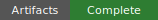
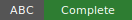

# Counterpoint One-Third Schema Tower Diagnostics Readout






## Status At A Glance

- Artifact evidence: complete; every required evaluation-level manifest, run
  index, aggregate table, and diagnostic result table exists and parses.
- Schema geometry: structural limit; all `24` runs show full first-projection
  collapse, so tier `1` collapses the base hidden graph to one state cell.
- ABC runtime: complete; `4800` controller/ABC events were summarized, and all
  `4800` were action-consistent under the recorded upstream selection context.
- Lift and concrete execution: executable at the base tier; `3840` lift
  attempts succeeded, `0` failed, and all `384` episodes emitted concrete
  counterpoint steps.
- Claim scope: diagnostic only; this is not a direct-vs-tower comparison, not a
  learning-performance claim, and not tensor-enabled runtime evidence.
- Provenance: repo-resident artifacts; the source tables live under this
  readout surface's checked-in `artifacts/small_medium_validation_001/` folder.

This repository directory is the human-readable readout surface for the
counterpoint one-third schema tower diagnostic evaluation.

Source evaluation root:

```text
/Users/foster/big_boy_benchmarking/docs/evaluations/counterpoint_symbolic_v001/one_third_schema_tower_diagnostics/artifacts/small_medium_validation_001/evaluations/counterpoint_one_third_schema_tower_diagnostics_v001
```

Source binding:

```text
readout_source.json
```

To regenerate this repo-side readout, execute the protocol against this
directory's checked-in source binding, not the README, raw artifact root, or raw
evaluation root:

```text
execute docs/prime_directive/artifact_table_to_readable_document_protocol.md at /Users/foster/big_boy_benchmarking/docs/evaluations/counterpoint_symbolic_v001/one_third_schema_tower_diagnostics/readout_source.json
```

Protocol applied:

```text
docs/prime_directive/artifact_table_to_readable_document_protocol.md
```

## Summary of Goals Behind this Evaluation

This evaluation asks one focused question: what does a source-local one-third
contraction schema do to the real counterpoint hidden graph when it is run
through BBB's tower adapter and upstream `state_collapser` active-tier
controller path?

The environment family is `counterpoint_symbolic_v001`. The locked run covers
two existing instances, `counterpoint_symbolic_n3_small_v001` and
`counterpoint_symbolic_n3_medium_v001`. The schema is
`counterpoint_one_third_outgoing_schema_v001`, which partitions each source
state's outgoing edges into recursively scheduled one-third blocks plus an
explicit unscheduled remainder.

The goal is diagnostic visibility, not performance comparison. The readout must
show whether BBB can describe the quotient tower geometry, whether upstream ABC
tier-selection evidence is visible, and whether selected abstract actions
actually lift into concrete counterpoint steps. It is explicitly not trying to
show tower advantage, direct baseline comparison, musical quality,
tensor-enabled behavior, CUDA/GPU performance, or production timing.

## Summary of Methodology Behind this Evaluation

The run uses BBB's one-third diagnostics runner in `tower_exploit_explore` mode.
For each instance, schema seed, and replicate, BBB constructs the one-third
schema, builds the tower, runs upstream ABC control through the counterpoint
tower adapter, records ordinary control events, records ABC-specific diagnostic
rows from the exact upstream helper inputs, and emits aggregate tables for
geometry, tier signals, lift behavior, control actions, and concrete steps.

The locked budget is `16` episodes per replicate, `4` replicates per schema
seed, schema seeds `0,1,2`, base seed `0`, and
`tensor_available_disabled`. Horizon is instance-specific: `8` concrete steps
for the small instance and `12` for the medium instance. The controller event
ceiling policy is `max(64, 8 * horizon)`.

Aggregation is descriptive. It counts completed runs, structural-limit
classifications, per-tier quotient shape, source-local schema block sizes,
upstream ABC selection signals, control action counts, lift attempts and
failures, concrete steps, episode terminations, and timing categories. Because
there is no direct arm or alternative schema arm in this evaluation, the result
can support only diagnostic claims about this schema/runtime combination.

## One-Screen Verdict

The evaluation succeeded as a diagnostic artifact run: all `24` expected runs
completed, all required result tables exist, and the runtime emitted `3840`
concrete counterpoint steps across `384` episodes.

The substantive result is a structural-limit finding. The one-third schema
does create the intended source-local block schedule, but the first quotient
projection collapses the whole base hidden graph into a single tier-`1` state
cell for every run on both small and medium. The tower therefore has a real
constructed shape, but it loses state distinction immediately above the base
tier.

That collapse does not mean the runtime failed. Lift/execution stayed
functional at tier `0`: `3840` lift attempts succeeded and none failed. It also
does not support ordinary learning-performance language. The correct claim is
that this one-third schema, on these fixtures and under this budget, becomes a
diagnostic full-collapse case while still allowing base-tier concrete execution.

## Files

- [readout_source.json](readout_source.json): source binding from this repo readout surface to the raw artifact tables.
- [result_readout.md](result_readout.md): full human readout.
- [method.md](method.md): methodology and budget summary.
- [glossary.md](glossary.md): field and mechanism translations.
- [runbook.md](runbook.md): rerun, summarize, and human-readout commands.
- [artifact_index.md](artifact_index.md): evidence map with file purposes.
- [results/summary.md](results/summary.md): compact reader-facing result summary.
- [results/human_summary.md](results/human_summary.md): short narrative result summary.
- [results/arm_readout_table.md](results/arm_readout_table.md): reader-facing diagnostic table by instance.
- [results/diagnostic_findings.md](results/diagnostic_findings.md): structural-limit, ABC, and lift/executability findings.
- [results/timing_readout.md](results/timing_readout.md): timing summary with category boundaries.

## Claim Boundary

This readout may claim:

- the one-third diagnostic run completed the locked small/medium budget;
- all required machine-readable artifacts exist and parse;
- the one-third schema produced the recorded source-local block schedules;
- all runs show full first-projection quotient collapse;
- upstream ABC diagnostic rows were recorded and summarized;
- concrete execution occurred at the base tier with no lift failures;
- this schema/runtime combination is a structural-limit diagnostic case.

This readout may not claim:

- direct-vs-tower performance comparison;
- positive or negative tower learning performance;
- tensor-enabled runtime behavior;
- CUDA or GPU performance;
- musical quality;
- production performance;
- a result beyond `counterpoint_symbolic_n3_small_v001` and
  `counterpoint_symbolic_n3_medium_v001`;
- a result beyond schema seeds `0,1,2`, `4` replicates per schema seed, and the
  recorded budget.

## Evidence Status

Required machine-readable result files exist and parse:

- `evaluation_manifest.json`
- `evaluation_budget_lock.json`
- `evaluation_run_index.csv`
- `evaluation_aggregate_table.csv`
- `evaluation_aggregate_summary.json`
- `results/schema_block_summary.csv`
- `results/tower_shape_summary.csv`
- `results/tier_executability_summary.csv`
- `results/control_action_summary.csv`
- `results/abc_selection_summary.csv`
- `results/abc_tier_signal_summary.csv`
- `results/tier_occupancy_summary.csv`
- `results/lift_failure_by_tier.csv`
- `results/concrete_step_summary.csv`

Files classified as not applicable by the source binding:

| File or evidence class | Classification | Interpretation |
| --- | --- | --- |
| `direct arm comparison tables` | `not_applicable` | This diagnostic has no direct-learning arm and no direct-vs-tower comparison. |
| `tensor-enabled conversion records` | `not_applicable` | The locked run uses `tensor_available_disabled`; tensor conversion records are outside the claim boundary. |

## Clarifying Questions And Turns

#### Project Owner / Evaluator Turn

> ...

#### Embedded Engineering Consultant / Codex Turn

> ...

#### Project Owner / Evaluator Turn

> ...

#### Embedded Engineering Consultant / Codex Turn

> ...

#### Project Owner / Evaluator Turn

> ...

#### Embedded Engineering Consultant / Codex Turn

> ...
