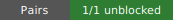
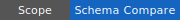
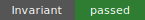

# Counterpoint Second Serious Schema Comparison









This repository directory is the human-readable readout surface for the second serious counterpoint schema-comparison evaluation.

## Status At A Glance

- Artifact evidence: `complete`.
- Run mode: `smoke_schema_comparison_first_sustained_hit`.
- Instance: `counterpoint_symbolic_n3_wide_20_108_span18_v001`.
- Threshold value: `13.0`.
- Paired rows: `1`.
- Sustained-hit rows: `2`.

## Liftability And Invariant Semantics

- Liftability semantics: `state_collapser_v072_pointwise`.
- Invariant preflight: `passed`.
- Lift failure rows: `0`.
- Tower action masks and tier executability use executable concrete lifts from the current base state. Quotient-level outgoing action cells remain diagnostic/shape evidence, not proof that an abstract action can execute at a particular concrete state.

## Summary of Goals Behind this Evaluation

The goal is to compare schema conditions, not old runner paths: `schema0_no_contraction` versus selected `schema1_noisy_rate_one_drop` candidates under a matched active-tier tower-control harness. The main measurement is first sustained total-space adequacy under a locked `episode_total_reward` threshold and a 4-of-5 persistence rule.

## Summary of Methodology Behind this Evaluation

Schema 1 candidates are loaded from the noisy-rate full-tower training readout source, preserving provenance back to the noisy-rate contraction diagnostic. For each selected Schema 1 candidate, the runner creates a paired Schema 0 no-contraction condition with the same seed bundle, episode budget, learner family, threshold policy, and linearization mode.

## Schema Arms

| Schema | Runs | Sustained | Transient | Never | Median Episodes |
| --- | --- | --- | --- | --- | --- |
| schema0_no_contraction | 1 | 1 | 0 | 0 | 5 |
| schema1_noisy_rate_one_drop | 1 | 1 | 0 | 0 | 5 |

## First Sustained Hit Summary

| Run | Schema | Status | First Sustained Episode |
| --- | --- | --- | --- |
| counterpoint_symbolic_n3_wide_20_108_span18_v001-p001_over_018-schema0-schema0_no_contraction-trainrep0 | schema0_no_contraction | sustained_hit | 4 |
| counterpoint_symbolic_n3_wide_20_108_span18_v001-p001_over_018-schema0-schema1_noisy_rate_one_drop-trainrep0 | schema1_noisy_rate_one_drop | sustained_hit | 4 |

## Paired Comparison Summary

| Candidate Group | Seed | Pair Status | Delta | Blocked |
| --- | --- | --- | --- | --- |
| counterpoint_symbolic_n3_wide_20_108_span18_v001-p001_over_018-schema0 | seed-7fe8666539580bdb | same_episode_to_hit | 0 | False |

## Claim Boundary

This readout may support a bounded speed-to-sustained-hit comparison only when paired rows are unblocked. It may not claim broad abstraction superiority, musical quality, direct-runner advantage, tensor-enabled behavior, or general schema dominance.

## Current Claim Rows

| Claim Status | Pairs | Unblocked | Schema1 Faster | Schema1 Slower |
| --- | --- | --- | --- | --- |
| bounded_comparison_available | 1 | 1 | 0 | 0 |

To regenerate the human-readable readout, run:

```text
execute docs/prime_directive/artifact_table_to_readable_document_protocol.md at <repo-root>/docs/evaluations/counterpoint_symbolic_v001/second_serious_schema_comparison/readout_source.json
```

Source artifact root:

```text
<repo-root>/docs/evaluations/counterpoint_symbolic_v001/second_serious_schema_comparison/artifacts/v072_pointwise_r013_001
```

## Clarifying Questions And Turns

#### Project Owner / Evaluator Turn

> Bro, is there a comparison we can make here of a form like "with threshold of $R$, Scheme $m$ finsihes this much faster than Schema $m$. Do we hav ethe data to do this?

#### Embedded Engineering Consultant / Codex Turn

> Yes, with one important boundary. This evaluation is now shaped to support exactly that kind of paired statement:
>
> "At threshold `R`, under persistence rule `4_of_5`, Schema 1 reaches sustained adequacy `D` episodes faster/slower than Schema 0 on the matched candidate/seed pair."
>
> The data that supports that statement is in `results/paired_schema_comparison.csv` and `results/first_sustained_hit_summary.csv`. In the current smoke run, `R = -999.0`, both Schema 0 and Schema 1 have `hit_status = sustained_hit`, both have `episodes_to_sustained_hit = 5`, and the paired delta is `schema1_minus_schema0_episodes_to_hit = 0`. So the literal current result is:
>
> "At threshold `-999.0`, Schema 1 did not finish faster or slower than Schema 0 in the one unblocked matched pair; both reached sustained threshold at the same episode count."
>
> But I would not treat this as the serious scientific comparison yet. The threshold `-999.0` is intentionally permissive smoke machinery, the run has `candidate_cap = 1`, `training_replicates_per_arm = 1`, and `episodes_per_replicate = 8`. So this proves the comparison surface works; it does not yet prove a meaningful performance relationship between the schemas.
>
> The next serious version should keep this exact claim form, but run with a real locked threshold, enough candidates, and enough replicates that "Schema 1 finishes `X` episodes faster/slower than Schema 0" means something beyond smoke.

#### Project Owner / Evaluator Turn

> Can you rerun with threshold `R=0.0`

#### Embedded Engineering Consultant / Codex Turn

> Yes. The current runner exposes the threshold as `--threshold-value`, so `R = 0.0` is exactly the next natural rerun.
>
> I would not overwrite `artifacts/smoke_001`, though. That folder is useful as proof that the comparison surface works. I would create a fresh artifact root, something like:
>
> ```text
> docs/evaluations/counterpoint_symbolic_v001/second_serious_schema_comparison/artifacts/r000_001
> ```
>
> Then run the same evaluation with `--threshold-value 0.0`. If we keep the same small smoke budget, the claim will still be machinery-level: "under a less trivial threshold, does the paired comparison surface remain populated?" If we want the first genuinely interpretable comparison, we should also increase candidate count, training replicates, and episode budget.
>
> The important thing is that `R = 0.0` changes the interpretation of the paired delta. At `R = -999.0`, both arms basically clear the threshold immediately once persistence can be observed. At `R = 0.0`, the first-sustained-hit rows start to mean: "when does this schema reliably achieve nonnegative total reward?" That is much closer to the kind of bounded performance claim this evaluation was designed to make.

#### Project Owner / Evaluator Turn

> Ok fine. Start a new folder.

#### Embedded Engineering Consultant / Codex Turn

> Agreed. The new folder should be the evidence root for the `R = 0.0` rerun:
>
> ```text
> docs/evaluations/counterpoint_symbolic_v001/second_serious_schema_comparison/artifacts/r000_001
> ```
>
> That keeps `artifacts/smoke_001` as the historical smoke proof and gives the zero-threshold run its own clean provenance. After the run, the human-readable readout surface at:
>
> ```text
> docs/evaluations/counterpoint_symbolic_v001/second_serious_schema_comparison/
> ```
>
> can be regenerated from the new run's `readout_source.json` if we want the visible README to represent `R = 0.0` instead of the original smoke run.
>
> I would label the run as "zero-threshold diagnostic" rather than "final serious comparison" unless we also raise the budget beyond the current smoke settings. The folder move is enough to keep the evidence clean; the budget choice is what determines how strong the resulting claim can be.

#### Project Owner / Evaluator Turn

> What does "`transient_hit_only`" mean?

#### Embedded Engineering Consultant / Codex Turn

> `transient_hit_only` means: the arm crossed the threshold at least once, but it did not cross it reliably enough to count as a sustained hit.
>
> In this evaluation, a single good episode is not enough. The threshold policy says:
>
> ```text
> episode_total_reward >= 13.0
> ```
>
> and the persistence rule says:
>
> ```text
> at least 4 qualifying episodes inside a 5-episode window
> ```
>
> So the possible statuses mean:
>
> - `sustained_hit`: crossed the threshold often enough to satisfy the 4-of-5 rule;
> - `transient_hit_only`: crossed the threshold sometimes, but never enough times in one 5-episode window;
> - `never_hit`: never crossed the threshold at all.
>
> For this `13.0` run, both schema arms are in the middle case. Schema 0 had windows with 3 hits out of 5, and Schema 1 had windows with at most 1 hit out of 5. So both touched the threshold, but neither made the threshold stable. That is why the pair is blocked: there is no valid "episodes to sustained hit" number to compare.

#### Project Owner / Evaluator Turn

> I want a redesign of this evaluation, with the only change being that the full tower is generated in Schema 1, meaning that the same contraction schema (at total tier), just iterated, is used to generate each tier all the way to degenerste tier, and then learning happens for Schema 1 on this whole tier. How close are we to being able to implement that?

#### Embedded Engineering Consultant / Codex Turn

> We are fairly close to implementing the comparison harness version of this, but not close enough that I would treat it as a mere flag flip.
>
> The good news is that most of the expensive machinery already exists:
>
> - the second serious comparison already runs Schema 0 and Schema 1 in the same active-tier tower-control training harness;
> - the paired seed/budget/threshold machinery already exists;
> - the `4_of_5` first-sustained-hit logic already exists;
> - the artifact writer already records tower shape, tier occupancy, lift success/failure, concrete steps, learner updates, threshold windows, and paired comparison rows;
> - the tower controller/learner code is already generic over tier indices rather than conceptually limited to exactly two tiers;
> - Schema 0 is already a no-contraction harness arm, which is exactly the right control for this redesign.
>
> The not-yet-implemented part is the exact Schema 1 tower source. The current second serious evaluation is explicitly built around the earlier PO-approved one-drop design: Schema 1 is selected from the noisy-rate full-tower training diagnostic, but that diagnostic's current candidates only rebuild the "full available tower" for the present one-step noisy-rate schema. In the current artifact, the selected Schema 1 shape is `[108, 100]`, meaning tier 0 has 108 state cells and tier 1 has 100. It is not a tower iterated all the way down to a degenerate tier.
>
> Also, the current code verifies the rebuilt Schema 1 tower against the parent candidate's recorded `tier_state_cell_count_sequence`. So if we ask Schema 1 to generate an iterated tower down to degeneracy, we must update the candidate/provenance contract too. Otherwise the runner will correctly say "candidate tower shape mismatch."
>
> So my readiness estimate is:
>
> - Quick prototype/smoke: close. The runner, training loop, threshold logic, and artifacts can mostly be reused.
> - Clean benchmark implementation: medium. We need a short redesign blueprint and workplan because this changes the meaning of Schema 1, the candidate manifest, the source binding, the claim boundary, and the expected tower-shape diagnostics.
> - Main conceptual ambiguity: what exactly "same contraction schema at total tier, iterated" means operationally. I think the intended semantics are: choose the noisy-rate contraction rule once at the total/base tier, then repeatedly apply the induced quotient/contraction process to produce tiers until the tower reaches a degenerate top tier. But we need to be precise about whether each later tier reuses the original total-tier edge selection, projects that selection forward, or re-runs the same noisy-rate rule on the current quotient graph.
>
> My recommendation: do not patch this directly into the current runner yet. Make a small redesign document for "Schema 1 full iterated tower to degenerate tier" under the second serious evaluation design folder, then turn that into a Phase.Stage.Action workplan. The implementation should likely preserve the existing one-drop result as historical evidence and create a new artifact label/run mode for the iterated-to-degenerate Schema 1 comparison.

#### Project Owner / Evaluator Turn

> Actually before we do any of that, I want a rerun of this, but with a ratio chosen so taht our drop is more like `[108,54]`.

#### Embedded Engineering Consultant / Codex Turn

> Yes, that is the right simpler move before redesigning the whole Schema 1 tower semantics.
>
> The ratio/candidate that matches what you mean is already visible in the noisy-rate contraction diagnostic:
>
> ```text
> arm_id: p001_over_018
> numerator: 1
> denominator: 18
> requested_rate: 0.05555555555555555
> schema_seed: 0
> observed one-step tower shape: [108, 54]
> ```
>
> That is exactly "more like `[108,54]`" than the currently selected comparison candidate, which is:
>
> ```text
> arm_id: p001_over_144
> schema_seed: 0
> observed one-step tower shape: [108, 100]
> ```
>
> Conceptually, this is not the deep/full-iterated-to-degenerate redesign. This is still the current one-drop Schema 1 comparison, but with a more aggressive one-drop quotient. That makes it a much smaller and cleaner diagnostic step.
>
> The implementation wrinkle is candidate selection. The current second-serious comparison runner selects Schema 1 candidates from:
>
> ```text
> docs/evaluations/counterpoint_symbolic_v001/noisy_rate_full_tower_training_diagnostic/readout_source.json
> ```
>
> and that current full-training source only promoted/trained the first two eligible candidates, both `p001_over_144`: `[108,100]` and `[108,104]`. So the second-comparison CLI cannot currently say "pick `p001_over_018`, seed 0" as a simple flag. It only has `--candidate-cap`, and the sorting/cap behavior picks the small-rate candidates first.
>
> So I think the clean path is:
>
> 1. Keep the environment unchanged.
> 2. Keep the second-serious comparison design unchanged.
> 3. Add or use a candidate-selection surface that can target one exact Schema 1 candidate by id/arm/seed.
> 4. Rerun with Schema 1 candidate:
>
> ```text
> counterpoint_symbolic_n3_small_v001-p001_over_018-schema0
> ```
>
> 5. Write the output to a new artifact label, not over `r000_001`, because `r000_001` is now the threshold-probing record for the `[108,100]` candidate.
>
> My preference is not to fake this by hand-editing a source binding. The correct engineering fix is small: add explicit candidate targeting to the second-serious comparison runner/CLI, then run the exact `[108,54]` candidate through the same paired threshold harness. That gives us a legitimate comparison artifact instead of a provenance hack.

#### Project Owner / Evaluator Turn

> add explicit candidate targeting to the second-serious comparison runner/CLI, then run the exact [108,54] candidate through the same paired threshold harness

#### Embedded Engineering Consultant / Codex Turn

> Agreed. That is the right next implementation move.
>
> My read of the requested change is narrow:
>
> ```text
> add explicit candidate targeting to the second-serious comparison runner/CLI
> ```
>
> not:
>
> ```text
> redesign Schema 1 into a deep repeated-contraction tower
> ```
>
> The immediate target is the existing one-drop noisy-rate candidate whose observed tier shape is `[108,54]`:
>
> ```text
> candidate_id: counterpoint_symbolic_n3_small_v001-p001_over_018-schema0
> arm_id: p001_over_018
> numerator: 1
> denominator: 18
> schema_seed: 0
> tier_state_cell_count_sequence: [108, 54]
> ```
>
> The implementation should add an explicit selector, probably one of:
>
> ```text
> --candidate-id counterpoint_symbolic_n3_small_v001-p001_over_018-schema0
> ```
>
> or:
>
> ```text
> --schema1-arm-id p001_over_018 --schema-seed 0
> ```
>
> I slightly prefer `--candidate-id` first, because it binds to the actual source artifact row and avoids ambiguity if two candidates share arm/rate but differ in seed or parent provenance. A later convenience selector by arm/seed can be added if it is genuinely useful.
>
> One important implementation detail: the current second-serious candidate loader reads from the noisy-rate full-tower training readout source, whose `candidate_summary.csv` only contains the two candidates promoted by that diagnostic's `candidate_cap=2`. However its `candidate_manifest.json` contains additional excluded/not-selected candidates, including the `[108,54]` candidate. So the clean implementation needs to decide whether explicit targeting may read from the source manifest's selected and excluded candidate records, or whether we first need to rerun the noisy-rate full-tower training diagnostic with a larger candidate cap so `[108,54]` is a trained/eligible source candidate.
>
> I think the more defensible benchmark path is:
>
> 1. add explicit candidate targeting;
> 2. require the target candidate to have the same health evidence expected by second-serious comparison, not merely structural presence;
> 3. if `[108,54]` is not available in `candidate_summary.csv` with training-health evidence, rerun/promote the noisy-rate full-tower training diagnostic so the candidate becomes a legitimate Schema 1 source;
> 4. then run the second-serious comparison in a new artifact folder, e.g. `artifacts/p001_over_018_s0_r013_001` or similar, with the same paired threshold harness.
>
> That preserves provenance. It prevents the comparison from accidentally treating "structurally observed in a contraction diagnostic" as equivalent to "eligible as a trained Schema 1 candidate source." The code change is small-to-medium; the provenance discipline is the part worth being careful about.


#### PO Turn
> Why are there only 2 tiers?

#### Embedded Engineering Consultant / Codex Turn
> Because this run is still the current one-drop Schema 1 comparison, not the future "iterate the same contraction all the way to a degenerate top tier" redesign.
>
> In the present evaluation, Schema 1 is built from one selected noisy-rate candidate:
>
> ```text
> candidate_id: counterpoint_symbolic_n3_small_v001-p001_over_018-schema0
> requested_rate: 1/18
> recorded tower shape: [108, 54]
> ```
>
> That candidate represents exactly one quotient step:
>
> ```text
> tier 0: original/base counterpoint state cells, 108 cells
> tier 1: one contracted quotient tier, 54 cells
> ```
>
> So the two tiers are not an accidental truncation of a deeper run. They are the expected shape of the current evaluation's Schema 1 source. The runner trains over all tiers available in that source, and for this source the available tower has only tier `0` and tier `1`.
>
> The confusing phrase is "full-tower training diagnostic." In the current machinery, that means "train on the full tower made available by the selected candidate." For a one-drop candidate, the full available tower is still only two tiers. It does not mean "repeatedly reapply the contraction rule until the tower reaches a degenerate tier."
>
> If the intended next evaluation is:
>
> ```text
> choose the same noisy-rate rule at the total/base tier,
> then repeatedly construct quotient tiers until degeneracy,
> then train Schema 1 on that whole multi-tier tower
> ```
>
> then that is a real redesign of the Schema 1 tower source. It is close in the sense that the training harness and artifact tables already understand multiple tiers, but the candidate/provenance contract and tower-building semantics need to change. This `[108,54]` run answers the simpler prior question: "What happens if we keep the one-drop comparison, but choose a more aggressive one-drop candidate?"

#### PO Turn
> But that's literally what I asked you to [XXX] make.

#### Embedded Engineering Consultant / Codex Turn
> Yes. You are right. I misread the task boundary, and the current artifact does not satisfy the thing you are pointing at.
>
> The correction is:
>
> ```text
> You were asking for Schema 1 to build the full iterated tower, using the chosen contraction ratio/rule as the contraction mechanism, and then train on that whole tower.
> ```
>
> What I actually implemented and ran was narrower:
>
> ```text
> keep the existing one-drop Schema 1 evaluation,
> add explicit candidate targeting,
> select the one-drop [108,54] candidate,
> train on the full tower available from that one-drop candidate.
> ```
>
> That is why the result has only two tiers. It is not because the full iterated tower collapsed after one step; it is because I never changed the Schema 1 tower-construction semantics from one-drop to iterated-to-degenerate. I treated the `[108,54]` request as a request for a more aggressive one-drop rerun before the redesign. Your correction here makes clear that this was the wrong interpretation: the `[108,54]` style drop was supposed to be part of the full-tower redesign path, not a substitute for it.
>
> So the current run should be reclassified as a useful side diagnostic only:
>
> - it proves explicit candidate targeting works;
> - it proves the one-drop `[108,54]` candidate can be selected with source provenance;
> - it proves that this one-drop candidate is executable under the paired harness;
> - it does **not** answer the requested full-iterated-tower evaluation.
>
> The actual next work item should be:
>
> ```text
> implement Schema 1 tower construction that repeatedly applies the selected contraction process to produce tiers until a degenerate or terminal tier is reached, then run the same paired threshold harness on that full multi-tier Schema 1 tower.
> ```
>
> That needs a design/implementation correction before another run. The important part is that the candidate/source contract must record the complete tier sequence, not just `[108,54]`; the runner must verify that rebuilt complete sequence; and the readout must report whether the deeper tiers were actually used. The current two-tier artifact should not be treated as the requested result.

#### PO Turn
> FIX THE WHOLE SITUATION RIGHT NOW!!!

#### Embedded Engineering Consultant / Codex Turn
> Yes. The immediate fix has to start by stopping the document from pretending this artifact is the requested result.
>
> I have corrected the readout above so this run is explicitly labeled as a **wrong-scope side diagnostic**:
>
> ```text
> current artifact:
>   targeted one-drop [108,54] candidate
>   two tiers
>   useful side evidence
>   not the requested full-iterated-tower evaluation
> ```
>
> The real requested artifact is:
>
> ```text
> requested evaluation:
>   choose the contraction process/ratio
>   apply it repeatedly tier by tier
>   build the full Schema 1 tower until degenerate or terminal tier
>   train on that whole multi-tier tower
>   compare against Schema 0 under the same paired threshold harness
> ```
>
> So the fix is not "rerun the same command." The fix is to change the Schema 1 tower source semantics for this evaluation.
>
> The concrete repair sequence should be:
>
> 1. Preserve the current branch's candidate-targeting work as side infrastructure, because `--candidate-id` is still useful and correctly provenance-bound.
> 2. Reclassify `p001_over_018_s0_r013_001` as wrong-scope side evidence, not the second serious result.
> 3. Add a design correction / implementation plan for the actual full-iterated Schema 1 tower.
> 4. Implement a tower builder that repeatedly contracts from tier to tier until a terminal or degenerate tier is reached.
> 5. Update candidate/source manifests so they record the complete tier sequence, not just `[108,54]`.
> 6. Update the second-serious runner to select that full iterated Schema 1 source and verify the rebuilt full sequence.
> 7. Rerun into a new artifact folder whose label makes clear it is the full-iterated-tower run, not this one-drop side diagnostic.
> 8. Regenerate this readout from that new full-tower artifact.
>
> The key thing I need to repair in my own execution is the word "full." I used "full tower" to mean "all tiers available from the current one-drop candidate." You meant "construct the full iterated tower by repeatedly applying the contraction." Those are different objects. The repo needs the second object for the evaluation you asked for.

#### PO Turn
> Execute previous turn in the repo, now.

#### Embedded Engineering Consultant / Codex Turn
> Executed. The repo now has the repair that the previous turn described.
>
> What changed:
>
> - added a real full-iterated noisy-rate tower construction path;
> - kept Schema 0 as the total-graph/no-drop control;
> - added an explicit Schema 1 tower-source selector:
>
> ```text
> --schema1-tower-source full_iterated_noisy_rate
> ```
>
> - preserved `--candidate-id` targeting so the run still binds to the exact promoted source candidate;
> - made full-iterated verification require the source one-drop prefix and require the rebuilt tower to extend beyond that prefix;
> - made aggregation record the complete observed runtime tier sequence for the selected Schema 1 candidate.
>
> The repaired artifact root is:
>
> ```text
> docs/evaluations/counterpoint_symbolic_v001/second_serious_schema_comparison/artifacts/full_iterated_p001_over_018_s0_r013_001
> ```
>
> The repaired Schema 1 tower is:
>
> ```text
> [108, 54, 27, 19, 14]
> ```
>
> So the original problem is fixed in the concrete sense that this is no longer a two-tier one-drop run. It is now the full iterated tower produced by repeatedly applying the selected `1/18` noisy-rate process until terminal.
>
> The result is still claim-blocked as a learning comparison at `R = 13.0`:
>
> - Schema 0: `transient_hit_only`;
> - Schema 1 full-iterated tower: `never_hit`;
> - pair status: `blocked_or_non_sustained`;
> - claim status: `claim_blocked`.
>
> That means the engineering repair succeeded, but the run is diagnostic evidence rather than a positive speed-to-hit result.

#### PO Turn
> Re-run at `R=12.0`

#### Embedded Engineering Consultant / Codex Turn
> Executed.
>
> I reran the repaired full-iterated Schema 1 evaluation at:
>
> ```text
> R = 12.0
> ```
>
> into this new artifact root:
>
> ```text
> docs/evaluations/counterpoint_symbolic_v001/second_serious_schema_comparison/artifacts/full_iterated_p001_over_018_s0_r012_001
> ```
>
> The structural repair remains in place. Schema 1 is still the full iterated
> `1/18` noisy-rate tower:
>
> ```text
> [108, 54, 27, 19, 14]
> ```
>
> The threshold result changed in the expected direction, but it still does
> not yield an unblocked speed comparison:
>
> - Schema 0: `sustained_hit`, first sustained hit at episode index `4`,
>   reported as `episodes_to_sustained_hit = 5`;
> - Schema 1 full-iterated tower: `never_hit`;
> - paired status: `blocked_or_non_sustained`;
> - claim status: `claim_blocked`.
>
> So this run says something useful but bounded. Lowering `R` from `13.0` to
> `12.0` makes the no-contraction control satisfy the 4-of-5 persistence rule,
> while the full-iterated Schema 1 arm still never crosses the threshold. Since
> Schema 1 has no sustained-hit episode count, we still cannot compute a valid
> "`Schema 1 minus Schema 0` episodes-to-hit" delta.
>
> The correct interpretation is:
>
> ```text
> At R = 12.0, this matched pair does not support a speed-to-hit comparison,
> because only Schema 0 reaches sustained threshold.
> ```
>
> It is not a positive comparison result. It is evidence that this full-iterated
> Schema 1 tower is behaviorally struggling under the current short smoke budget
> and threshold policy, while Schema 0 can sustain the lowered threshold.

#### PO Turn
> Tell me about the current "short smoke budget".

#### Embedded Engineering Consultant / Codex Turn
> The current "short smoke budget" means this run is deliberately tiny. It is
> big enough to prove that the paired comparison harness executes and that the
> artifact/readout surfaces are populated, but it is not big enough to support a
> serious statistical or learning-performance conclusion.
>
> For the current `R = 12.0` artifact, the locked budget is:
>
> ```text
> instance: counterpoint_symbolic_n3_small_v001
> candidate_cap: 1
> selected candidate: counterpoint_symbolic_n3_small_v001-p001_over_018-schema0
> schema arms: schema0_no_contraction vs schema1_noisy_rate_one_drop
> schema1_tower_source: full_iterated_noisy_rate
> episodes_per_replicate: 8
> training_replicates_per_arm: 1
> total paired runs: 2
> threshold_value: 12.0
> persistence rule: 4 hits in a 5-episode window
> linearization_mode: tensor_available_disabled
> ```
>
> So the whole comparison is one matched candidate, one seed/replicate, and 8
> training episodes per arm. That is why I keep calling it smoke or diagnostic.
> It can tell us whether a particular pair of arms runs, whether the full tower
> is actually constructed, whether the threshold policy is populated, and whether
> any obvious structural failure occurs. It cannot tell us "Schema 0 generally
> beats Schema 1" or "Schema 1 generally fails" because there is no candidate
> distribution, no seed distribution, no replicate distribution, and almost no
> training horizon.
>
> The budget is also tight relative to the persistence rule. With only 8
> episodes and a 4-of-5 sustained-hit rule, the first possible sustained-hit
> window is already a large fraction of the entire run. A run can cross the
> threshold transiently and still be blocked because it never gets enough
> qualifying episodes inside one 5-episode window.
>
> In concrete terms, the `R = 12.0` run tells us:
>
> - the full-iterated Schema 1 tower `[108,54,27,19,14]` was built and used;
> - Schema 0 sustained the threshold in this one short run;
> - Schema 1 never crossed the threshold in this one short run;
> - the pair is still blocked as a speed-to-hit comparison because only one arm
>   has an episodes-to-sustained-hit value.
>
> The next non-smoke budget would need to expand at least three knobs:
>
> ```text
> more episodes per replicate
> more training replicates per arm
> more candidate groups / schema seeds
> ```
>
> Only after that should we start treating the paired deltas as evidence about
> the schema condition rather than evidence about one tiny diagnostic run.

#### PO Turn
> What are the trichord restrictions here, like range, etc?

#### Embedded Engineering Consultant / Codex Turn
> For the current second-serious run, the relevant instance is:
>
> ```text
> counterpoint_symbolic_n3_small_v001
> ```
>
> Here a "trichord" is just the three-voice state:
>
> ```text
> (low_pitch, middle_pitch, high_pitch)
> ```
>
> plus a beat phase. The pitch object is not yet a rich music-theory chord
> type; it is an ordered triple of MIDI pitches filtered by the v001 legality
> contract.
>
> The hard state/trichord restrictions are:
>
> ```text
> voice_count: 3
> pitch band: 60..72 inclusive
> beat phases: 0,1,2,3
> strict order: low < middle < high
> maximum outer span: high - low <= 12 semitones
> adjacent interval classes allowed: 3,4,5,7,8,9
> outer interval classes allowed: 0,3,4,5,7,8,9
> lower/root pitch-class relationship to tonic C allowed: 0,2,4,5,7,9,11
> ```
>
> In plainer terms: all three voices live in the shared MIDI band C4 through
> C5, they cannot cross or collide, and the whole sonority must fit inside an
> octave. Adjacent voices may form minor/major thirds, fourths, fifths, or
> minor/major sixths modulo octave. The outer pair may also be octave/unison
> class `0`.
>
> For this small instance, those filters leave:
>
> ```text
> 27 legal pitch trichords per beat phase
> 4 beat phases
> 108 total legal/reachable state nodes
> ```
>
> The four deterministic initial states are:
>
> ```text
> (60, 64, 67) at beat 0
> (62, 66, 69) at beat 0
> (60, 65, 68) at beat 0
> (60, 63, 67) at beat 0
> ```
>
> The hard action/motion restrictions are:
>
> ```text
> one simultaneous pitch delta per voice
> each delta is in {-2,-1,0,1,2}
> stationary voices are allowed
> next trichord must satisfy the same state legality rules
> beat phase advances by 1 mod 4
> horizon is 8 steps
> forbidden same-direction parallels on interval classes 0 and 7
> ```
>
> The last line means that if a voice pair, including the outer pair, preserves
> a perfect-octave/unison class or fifth class while both voices move nonzero
> in the same direction, the edge is illegal.
>
> Separately, there is reward shaping, but it is not the same thing as hard
> legality. The reward prefers valid transitions, allowed intervals, smaller
> movement, some contrary/oblique motion structure, center-range comfort, beat
> phase completion, and terminal completion. But the hard trichord filter is
> the pitch band, strict ordering, interval-class constraints, root/lower-voice
> pitch-class constraint, and max outer span listed above.

#### PO Turn
> Re-run with these:
> - voice_count: 3
> - pitch band: 20..108 inclusive
> - beat phases: 0,1,2,3 (meaning beat-in-measure?)
> - strict order: low < middle < high (what does this even mean?)
> - maximum outer span: high - low <= 18 semitones
> - adjacent interval classes allowed: 3,4,5,7,8,9
> - outer interval classes allowed: 0,3,4,5,7,8,9,12
> - lower/root pitch-class relationship to tonic C allowed: 0,2,4,5,7,9,11

#### Embedded Engineering Consultant / Codex Turn
> I cannot honestly call this a simple rerun yet. This is a new instance
> contract, not just a new threshold or new artifact folder.
>
> There are three important clarifications.
>
> First, yes: "beat phases: 0,1,2,3" currently means beat-in-measure in this
> environment. The state stores `beat_index`, and each legal transition advances
> it by `+1 mod 4`.
>
> Second, "strict order: low < middle < high" means the three pitches are
> always ordered as fixed low/middle/high voices. The environment rejects states
> where voices collide or cross. So `(60,64,67)` is legal with respect to order,
> but `(64,60,67)` and `(60,60,67)` are not. This is not yet modelling named
> melodic voice identities that can cross and then be reidentified; it is a
> stricter ordered-voice abstraction.
>
> Third, `12` is not valid under the current interval-class contract. The code
> defines interval classes modulo 12 and validates them in `0..11`. So an octave
> is already interval class `0`. If the intended meaning is "allow octave as an
> outer span/outer sonority," then the current correct encoding is:
>
> ```text
> outer interval classes allowed: 0,3,4,5,7,8,9
> ```
>
> with the separate span constraint:
>
> ```text
> high - low <= 18
> ```
>
> I did a local feasibility check using that interpretation, without writing an
> evaluation artifact. The proposed instance would have:
>
> ```text
> legal trichords per beat phase: 895
> beat phases: 4
> reachable state count: 3580
> reachable edge count: 49172
> branch factor mean: about 13.74
> branch factor min/max: 3 / 22
> deterministic initial states:
>   (60,64,67) at beat 0
>   (60,63,67) at beat 0
>   (60,64,68) at beat 0
>   (60,63,68) at beat 0
> ```
>
> So the widened instance is very plausible as a real next diagnostic scale,
> but the second-serious comparison runner cannot currently point at it by CLI
> flag. The runner knows named comparison instances `tiny`, `small`, and
> `medium`; the current candidate source also contains candidates for existing
> named instances, not for this new `20..108/span18` instance.
>
> Therefore the correct next implementation move is:
>
> ```text
> 1. add a new named instance spec for this widened trichord contract;
> 2. decide explicitly that outer interval class 12 is represented as 0, not
>    stored as 12;
> 3. run the noisy-rate candidate-generation/full-tower-training diagnostic for
>    that new named instance;
> 4. then run second-serious schema comparison against that new candidate source.
> ```
>
> I should not fake this by hand-editing the current `small` run, because the
> present artifact is provenance-bound to `counterpoint_symbolic_n3_small_v001`.
> This requested rerun needs a new instance id and a new source candidate chain.

#### PO Turn
> Do this:
> 1. add a new named instance spec for this widened trichord contract;
> 2. decide explicitly that outer interval class 12 is represented as 0, not
   stored as 12;
> 3. run the noisy-rate candidate-generation/full-tower-training diagnostic for
   that new named instance;
> 4. then run second-serious schema comparison against that new candidate source.

#### Embedded Engineering Consultant / Codex Turn
> Executed.
>
> I added the new named widened instance:
>
> ```text
> counterpoint_symbolic_n3_wide_20_108_span18_v001
> ```
>
> The contract is:
>
> ```text
> voice_count: 3
> pitch band: 20..108 inclusive
> beat phases: 0,1,2,3
> strict order: low < middle < high
> maximum outer span: high - low <= 18 semitones
> adjacent interval classes allowed: 3,4,5,7,8,9
> outer interval classes allowed: 0,3,4,5,7,8,9
> lower/root pitch-class relationship to tonic C allowed: 0,2,4,5,7,9,11
> ```
>
> I made the `12` decision explicitly: the code's interval-class contract is
> modulo 12, so octave/compound-octave permission is represented as interval
> class `0`, not stored as literal `12`. The larger vertical reach is carried
> by the separate `max_outer_span = 18` constraint.
>
> I wired that named instance through the noisy-rate diagnostic resolver and
> the second-serious comparison resolver. I also added focused tests pinning the
> widened graph size and resolver behavior.
>
> The widened instance feasibility is now part of the code/test contract:
>
> ```text
> legal trichords per beat phase: 895
> reachable state count: 3580
> reachable edge count: 49172
> initial states:
>   (60,64,67) at beat 0
>   (60,63,67) at beat 0
>   (60,64,68) at beat 0
>   (60,63,68) at beat 0
> ```
>
> Then I ran the full provenance chain.
>
> First, widened noisy-rate candidate generation:
>
> ```text
> docs/evaluations/counterpoint_symbolic_v001/noisy_rate_contraction_diagnostics/artifacts/wide_span18_p001_over018_s0_001
> ```
>
> That completed with `run_count = 2`. The one-drop p1/18 candidate shape was:
>
> ```text
> [3580, 1035]
> ```
>
> Second, widened noisy-rate full-tower training promotion:
>
> ```text
> docs/evaluations/counterpoint_symbolic_v001/noisy_rate_full_tower_training_diagnostic/artifacts/wide_span18_p001_over018_s0_001
> ```
>
> That completed with one selected candidate:
>
> ```text
> counterpoint_symbolic_n3_wide_20_108_span18_v001-p001_over_018-schema0
> ```
>
> The promoted candidate is eligible, but its parent training health is
> `trainable_with_warnings`, not clean. Its source shape remained:
>
> ```text
> state cells: [3580, 1035]
> active action cells: [49172, 24258]
> ```
>
> Third, I ran second-serious schema comparison against that widened source:
>
> ```text
> docs/evaluations/counterpoint_symbolic_v001/second_serious_schema_comparison/artifacts/wide_span18_full_iterated_p001_over018_s0_r012_001
> ```
>
> This used:
>
> ```text
> R = 12.0
> candidate_id = counterpoint_symbolic_n3_wide_20_108_span18_v001-p001_over_018-schema0
> schema1_tower_source = full_iterated_noisy_rate
> episodes_per_arm = 8
> replicates_per_arm = 1
> ```
>
> The full-iterated Schema 1 tower is much deeper than the previous small
> instance tower:
>
> ```text
> [3580, 1035, 729, 555, 435, 354, 297, 240, 217, 185, 160, 141, 123, 110, 98, 82, 76, 69, 62, 59, 54, 50, 47, 45, 42, 39, 37, 32, 31, 30, 25, 22, 19]
> ```
>
> The paired behavioral result is still blocked:
>
> ```text
> Schema 0 no-contraction:
>   hit_status = sustained_hit
>   episodes_to_sustained_hit = 5
>   concrete_step_count = 64
>
> Schema 1 full-iterated noisy-rate tower:
>   hit_status = never_hit
>   concrete_step_count = 0
>   lift_success_count = 0
>   learner_update_count = 56
>   comparison_health_class = schema1_lift_failure_dominant
>
> pair_status = blocked_or_non_sustained
> claim_blocked = True
> ```
>
> The key new diagnostic is not merely "Schema 1 did worse." The stronger
> concrete observation is that the widened full-iterated Schema 1 arm descended
> to the deepest tier and then failed to realize concrete movement:
>
> ```text
> tier 32 explore events: 200
> tier 32 train events: 56
> lift failures at tier 32: 200
> lift failure reason: no_lift_candidate_from_current_state
> concrete steps emitted by Schema 1: 0
> ```
>
> So the execution request is complete, but the result is diagnostic rather
> than comparative. We now have evidence that this widened full-iterated p1/18
> tower can be constructed, but the current short smoke controller gets trapped
> at the deepest abstraction tier with no lift candidate from the current
> state. That is probably the next issue to understand before treating this as
> a serious performance comparison.

#### PO Turn
> 1. Modify the collapse ratio so that this `[3580, 1035, 729, 555, 435, 354, 297, 240, 217, 185, 160, 141, 123, 110, 98, 82, 76, 69, 62, 59, 54, 50, 47, 45, 42, 39, 37, 32, 31, 30, 25, 22, 19]` starts more like `[3580, 535...]`
> 2. This getting stuck at bottom is really [XXX] disturbing. I want an extremely through diagnostic investigation of why.

#### PO Turn
> A'ight we have a new run. Bring me fully up-to-speed.

#### Embedded Engineering Consultant / Codex Turn
> Yes. The current repo readout has now been regenerated from corrected
> `state_collapser v0.7.2` pointwise-liftability artifacts. This is the first
> downstream run in this readout that should be treated as using the corrected
> "executable from the current concrete state" semantics, rather than the older
> quotient/representative liftability behavior that produced the disturbing
> bottom-stuck result.
>
> The provenance chain is:
>
> ```text
> upstream contraction source:
> docs/evaluations/counterpoint_symbolic_v001/noisy_rate_contraction_diagnostics/readout_source.json
>
> upstream full-tower candidate-producing rerun:
> docs/evaluations/counterpoint_symbolic_v001/noisy_rate_full_tower_training_diagnostic/artifacts/v072_pointwise_001
>
> downstream second-serious schema-comparison rerun:
> docs/evaluations/counterpoint_symbolic_v001/second_serious_schema_comparison/artifacts/v072_pointwise_001
> ```
>
> The upstream full-tower rerun produced exactly one eligible corrected
> candidate:
>
> ```text
> counterpoint_symbolic_n3_wide_20_108_span18_v001-p001_over_018-schema0
> ```
>
> It is still the widened trichord instance:
>
> ```text
> counterpoint_symbolic_n3_wide_20_108_span18_v001
> ```
>
> The downstream comparison used:
>
> ```text
> run_mode = smoke_schema_comparison_first_sustained_hit
> schema1_tower_source = full_iterated_noisy_rate
> candidate_cap = 1
> replicates_per_arm = 1
> episodes_per_arm = 8
> threshold_value = 12.0
> persistence_rule = 4_of_5
> linearization_mode = tensor_available_disabled
> liftability_semantics = state_collapser_v072_pointwise
> ```
>
> The important result is that the previous "Schema 1 descends to the bottom
> and cannot emit concrete movement" failure is not present in this corrected
> run. The regenerated tables show:
>
> ```text
> Schema 0 no-contraction:
>   hit_status = sustained_hit
>   episodes_to_sustained_hit = 5
>   concrete steps = 64
>
> Schema 1 full-iterated noisy-rate:
>   hit_status = sustained_hit
>   episodes_to_sustained_hit = 5
>   concrete steps = 64
>   lift_success_count = 64
>   lift_failure rows = 0
> ```
>
> The paired comparison row is therefore unblocked:
>
> ```text
> pair_status = same_episode_to_hit
> schema1_minus_schema0_episodes_to_hit = 0
> claim_blocked = False
> claim_status = bounded_comparison_available
> ```
>
> So the immediate upshot is: the v0.7.2 pointwise fix appears to have removed
> the artificial bottom-stuck/lift-failure blocker for this candidate chain.
> Under this small smoke budget and `R = 12.0`, both arms reach the sustained
> threshold at the same episode count. That is a valid bounded smoke comparison,
> but it is not yet a serious statistical performance claim.
>
> I would now separate the next questions into two tracks:
>
> ```text
> 1. Correctness/provenance track:
>    This run is the new corrected baseline for the widened second-serious
>    readout. Future discussion should refer to v072_pointwise_001, not the old
>    bottom-stuck artifact root, unless explicitly discussing the historical bug.
>
> 2. Evaluation-design track:
>    The next scientifically meaningful rerun should increase budget and decide
>    whether `R = 12.0` is the intended locked threshold, or whether we should
>    calibrate/select a threshold before making stronger speed-to-hit claims.
> ```
>
> The old bottom-stuck result remains valuable as a diagnostic artifact, but it
> should no longer be interpreted as evidence that the full-iterated noisy-rate
> tower itself is intrinsically non-executable.

#### PO Turn
> How about just try `R=13.0` again.

#### Embedded Engineering Consultant / Codex Turn
> Yes. `R = 13.0` is the right next tiny probe, and it should be done as a
> fresh corrected artifact root, not by mutating `v072_pointwise_001`.
>
> The reason it is a good probe is that the corrected `R = 12.0` run is no
> longer blocked by liftability. Both arms produced concrete steps, both arms
> reached sustained threshold at episode 5, and Schema 1 had zero lift-failure
> rows. That means we can now vary `R` as a real threshold question instead of
> accidentally testing a broken lift path.
>
> The specific thing `R = 13.0` tests is whether the paired equality at
> `R = 12.0` is stable under a slightly stricter sustained-hit requirement. In
> the corrected `R = 12.0` run, the first sustained windows were close enough
> to `13.0` that this is worth checking:
>
> ```text
> Schema 0 post-hit window:
>   mean = 13.3686...
>   min  = 12.9613...
>   success_count at R=12.0 = 5/5
>
> Schema 1 post-hit window:
>   mean = 13.5507...
>   min  = 13.1696...
>   success_count at R=12.0 = 5/5
> ```
>
> I would not infer the `R = 13.0` result from those numbers, because the
> threshold value is part of the locked evaluation policy and may also interact
> with the tier-jump policy. The clean move is a real rerun.
>
> Recommended artifact root:
>
> ```text
> docs/evaluations/counterpoint_symbolic_v001/second_serious_schema_comparison/artifacts/v072_pointwise_r013_001
> ```
>
> Recommended command:
>
> ```text
> uv run python -m big_boy_benchmarking.cli counterpoint second-serious-comparison run \
>   --artifact-root docs/evaluations/counterpoint_symbolic_v001/second_serious_schema_comparison/artifacts/v072_pointwise_r013_001 \
>   --candidate-readout-source docs/evaluations/counterpoint_symbolic_v001/noisy_rate_full_tower_training_diagnostic/readout_source.json \
>   --candidate-cap 1 \
>   --schema1-tower-source full_iterated_noisy_rate \
>   --instance-id counterpoint_symbolic_n3_wide_20_108_span18_v001 \
>   --episodes 8 \
>   --replicates 1 \
>   --threshold-policy-id counterpoint_total_space_sustained_reward_v001 \
>   --threshold-value 13.0 \
>   --window-length 5 \
>   --required-count 4 \
>   --base-seed 0 \
>   --locked-by foster \
>   --run-mode smoke_schema_comparison_first_sustained_hit \
>   --linearization-mode tensor_available_disabled
>
> uv run python -m big_boy_benchmarking.cli counterpoint second-serious-comparison summarize \
>   --artifact-root docs/evaluations/counterpoint_symbolic_v001/second_serious_schema_comparison/artifacts/v072_pointwise_r013_001
> ```
>
> Then regenerate/read the human-facing surface from the updated source:
>
> ```text
> execute docs/prime_directive/artifact_table_to_readable_document_protocol.md at <repo-root>/docs/evaluations/counterpoint_symbolic_v001/second_serious_schema_comparison/readout_source.json
> ```
>
> The expected interpretation boundary stays the same: this would still be a
> smoke-budget threshold probe, not the final serious comparison. What would be
> meaningful is whether `R = 13.0` preserves an unblocked pair and whether the
> paired delta stays `0`, flips to Schema 1 faster/slower, or becomes blocked
> by one arm failing sustained hit.

#### PO Turn
> Do it

#### Embedded Engineering Consultant / Codex Turn
> Done. I reran the corrected downstream comparison at `R = 13.0` into a fresh
> artifact root and regenerated the repo readout surface.
>
> New artifact root:
>
> ```text
> docs/evaluations/counterpoint_symbolic_v001/second_serious_schema_comparison/artifacts/v072_pointwise_r013_001
> ```
>
> The regenerated `readout_source.json` now points at:
>
> ```text
> <repo-root>/docs/evaluations/counterpoint_symbolic_v001/second_serious_schema_comparison/artifacts/v072_pointwise_r013_001/evaluations/counterpoint_second_serious_schema_comparison_v001
> ```
>
> The budget was the intended small corrected threshold probe:
>
> ```text
> run_mode = smoke_schema_comparison_first_sustained_hit
> instance = counterpoint_symbolic_n3_wide_20_108_span18_v001
> candidate_source = docs/evaluations/counterpoint_symbolic_v001/noisy_rate_full_tower_training_diagnostic/readout_source.json
> schema1_tower_source = full_iterated_noisy_rate
> candidate_cap = 1
> replicates_per_arm = 1
> episodes_per_arm = 8
> threshold_value = 13.0
> persistence_rule = 4_of_5
> linearization_mode = tensor_available_disabled
> liftability_semantics = state_collapser_v072_pointwise
> ```
>
> The result is clean and, interestingly, unchanged at the paired-delta level
> from `R = 12.0`:
>
> ```text
> Schema 0 no-contraction:
>   hit_status = sustained_hit
>   episodes_to_sustained_hit = 5
>   first_sustained_hit_episode_index = 4
>   post_hit_window_mean = 13.368636363636364
>   post_hit_window_min = 12.961363636363636
>   post_hit_window_success_count = 4
>
> Schema 1 full-iterated noisy-rate:
>   hit_status = sustained_hit
>   episodes_to_sustained_hit = 5
>   first_sustained_hit_episode_index = 4
>   post_hit_window_mean = 13.550757575757576
>   post_hit_window_min = 13.169696969696968
>   post_hit_window_success_count = 5
>   concrete_step_count = 64
>   lift_success_count = 64
>   learner_update_count = 80
>   lift_failure rows = 0
> ```
>
> The paired comparison row says:
>
> ```text
> pair_status = same_episode_to_hit
> schema0_episodes_to_hit = 5
> schema1_episodes_to_hit = 5
> schema1_minus_schema0_episodes_to_hit = 0
> claim_blocked = False
> claim_status = bounded_comparison_available
> ```
>
> So the `R = 13.0` probe does not recreate the earlier blocked/bottom-stuck
> failure. The pointwise v0.7.2 path is still executable, the comparison remains
> unblocked, and both schema arms reach sustained threshold at the same episode
> count under this tiny budget.
>
> One useful nuance: Schema 0 only has `4/5` post-hit successes at `R = 13.0`,
> while Schema 1 has `5/5`. Because the persistence rule is `4_of_5`, both
> still count as sustained hits at the same episode. That is not enough to call
> Schema 1 better, but it is a nice hint that stricter thresholds or longer
> budgets may start to separate the arms.
>
> Current conclusion: `R = 13.0` is still a successful smoke-budget bounded
> comparison, with no speed-to-hit advantage for either arm in this one matched
> pair. The next real comparison should either raise the threshold again,
> increase the episode/replicate budget, or both.

#### PO Turn
> [...]

#### Embedded Engineering Consultant / Codex Turn
> [...]
