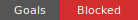

# Counterpoint Second Serious Schema Comparison - Full-Iterated Repair Run





This is the repo-side human-readable readout for the repaired full-iterated
Schema 1 run. The previous `[108,54]` artifact was only one-drop side evidence.
This artifact uses the same `1/18` noisy-rate contraction process, then
continues tier by tier until the sampled quotient process reaches a terminal
tier.

## Status At A Glance

- Artifact evidence: complete. The repaired run wrote manifests, run index,
  aggregate tables, tower shape tables, threshold windows, paired comparison,
  and a repo-side `readout_source.json`.
- Tower source: `full_iterated_noisy_rate`, explicitly recorded in
  `evaluation_budget_lock.json`.
- Schema 1 runtime tower: `[108, 54, 27, 19, 14]` state cells, with active
  action-cell sequence `[1140, 1029, 647, 488, 215]`.
- Terminal tier: tier `4` has 14 state cells. It is not a one-cell degenerate
  tier; the iterative process stopped because the next quotient sampling step
  produced no further selected representative edge under this `1/18` rule.
- Behavioral result: diagnostic. Schema 0 is `transient_hit_only`; Schema 1 is
  `never_hit` at `R = 13.0`.
- Goal result: blocked for speed-to-sustained-hit comparison. There is no valid
  delta because neither side has a sustained-hit episode.

## Summary of Goals Behind this Evaluation

The goal of this repair was to execute the actual requested Schema 1 object:
not a one-drop candidate, but a full iterated tower. The selected source
candidate still starts from the PO-requested `1/18` noisy-rate contraction whose
first drop is `[108,54]`, but Schema 1 now keeps applying the contraction
process tier by tier.

The comparison remains:

- `schema0_no_contraction`: the total-graph/no-drop control arm;
- `schema1_noisy_rate_one_drop`: the named Schema 1 class, now sourced by the
  full-iterated noisy-rate tower for this run.

The intended measurable claim is still bounded:

```text
At threshold R, under the locked 4-of-5 persistence rule, does one schema reach
sustained total-space adequacy faster than the other on the matched pair?
```

This run answers the structural repair question and provides diagnostic
learning evidence. It does not support a positive speed-to-hit comparison at
`R = 13.0`.

## Summary of Methodology Behind this Evaluation

The run uses the same promoted source candidate:

```text
counterpoint_symbolic_n3_small_v001-p001_over_018-schema0
```

The CLI explicitly targets that candidate and explicitly requests full-iterated
Schema 1 construction:

```text
--candidate-id counterpoint_symbolic_n3_small_v001-p001_over_018-schema0
--schema1-tower-source full_iterated_noisy_rate
```

Tier `1` matches the existing one-drop source prefix `[108,54]`. Later tiers
are produced by resampling representative quotient edges with the same
noisy-rate process and scheduling one contraction block per successful
iteration. The observed full runtime sequence is:

```text
tier 0: 108 state cells, 1140 active action cells
tier 1: 54 state cells, 1029 active action cells
tier 2: 27 state cells, 647 active action cells
tier 3: 19 state cells, 488 active action cells
tier 4: 14 state cells, 215 active action cells
```

The run uses one candidate, one replicate per arm, 8 episodes per arm,
`tensor_available_disabled`, threshold `R = 13.0`, and the `4_of_5`
persistence rule.

## One-Screen Verdict

The repair was executed. Schema 1 is no longer the wrong two-tier one-drop
artifact. The selected candidate summary now records the complete observed
runtime tier sequence `[108,54,27,19,14]`, and the tower-shape table records all
five tiers.

The behavioral comparison is still blocked. Schema 0 first crosses `R = 13.0`
but never satisfies the persistence rule. Schema 1 never crosses `R = 13.0` in
this short run. Therefore the paired comparison remains
`blocked_or_non_sustained`, with `claim_blocked=True`.

This is diagnostic evidence about the full-iterated Schema 1 tower, not a
positive schema-performance claim.

## Schema Arms

| Schema | Runs | Sustained | Transient | Never | Median Episodes |
| --- | --- | --- | --- | --- | --- |
| schema0_no_contraction | 1 | 0 | 1 | 0 |  |
| schema1_noisy_rate_one_drop | 1 | 0 | 0 | 1 |  |

## First Sustained Hit Summary

| Run | Schema | Status | First Sustained Episode |
| --- | --- | --- | --- |
| counterpoint_symbolic_n3_small_v001-p001_over_018-schema0-schema0_no_contraction-trainrep0 | schema0_no_contraction | transient_hit_only |  |
| counterpoint_symbolic_n3_small_v001-p001_over_018-schema0-schema1_noisy_rate_one_drop-trainrep0 | schema1_noisy_rate_one_drop | never_hit |  |

## Paired Comparison Summary

| Candidate Group | Seed | Pair Status | Delta | Blocked |
| --- | --- | --- | --- | --- |
| counterpoint_symbolic_n3_small_v001-p001_over_018-schema0 | seed-7fe8666539580bdb | blocked_or_non_sustained |  | True |

## Claim Boundary

This readout may claim that the full-iterated Schema 1 tower source was
implemented and executed for the targeted `1/18` candidate. It may claim that
the observed full runtime tower shape is `[108,54,27,19,14]`. It may claim that
the paired threshold comparison is blocked at `R = 13.0`.

It may not claim Schema 1 is generally worse, Schema 0 is generally better,
tower abstraction is generally bad, tensor-enabled behavior, GPU/CUDA behavior,
musical quality, or a final serious schema-performance result.

## Current Claim Rows

| Claim Status | Pairs | Unblocked | Schema1 Faster | Schema1 Slower |
| --- | --- | --- | --- | --- |
| claim_blocked | 1 | 0 | 0 | 0 |

To regenerate the human-readable readout, run:

```text
execute docs/prime_directive/artifact_table_to_readable_document_protocol.md at /Users/foster/big_boy_benchmarking/docs/evaluations/counterpoint_symbolic_v001/second_serious_schema_comparison/readout_source.json
```

Source artifact root:

```text
docs/evaluations/counterpoint_symbolic_v001/second_serious_schema_comparison/artifacts/full_iterated_p001_over_018_s0_r013_001
```

## Clarifying Questions And Turns

#### Project Owner / Evaluator Turn

> Bro, is there a comparison we can make here of a form like "with threshold of $R$, Scheme $m$ finsihes this much faster than Schema $m$. Do we hav ethe data to do this?

#### Embedded Engineering Consultant / Codex Turn

> Yes, with one important boundary. This evaluation is now shaped to support exactly that kind of paired statement:
>
> "At threshold `R`, under persistence rule `4_of_5`, Schema 1 reaches sustained adequacy `D` episodes faster/slower than Schema 0 on the matched candidate/seed pair."
>
> The data that supports that statement is in `results/paired_schema_comparison.csv` and `results/first_sustained_hit_summary.csv`. In the current smoke run, `R = -999.0`, both Schema 0 and Schema 1 have `hit_status = sustained_hit`, both have `episodes_to_sustained_hit = 5`, and the paired delta is `schema1_minus_schema0_episodes_to_hit = 0`. So the literal current result is:
>
> "At threshold `-999.0`, Schema 1 did not finish faster or slower than Schema 0 in the one unblocked matched pair; both reached sustained threshold at the same episode count."
>
> But I would not treat this as the serious scientific comparison yet. The threshold `-999.0` is intentionally permissive smoke machinery, the run has `candidate_cap = 1`, `training_replicates_per_arm = 1`, and `episodes_per_replicate = 8`. So this proves the comparison surface works; it does not yet prove a meaningful performance relationship between the schemas.
>
> The next serious version should keep this exact claim form, but run with a real locked threshold, enough candidates, and enough replicates that "Schema 1 finishes `X` episodes faster/slower than Schema 0" means something beyond smoke.

#### Project Owner / Evaluator Turn

> Can you rerun with threshold `R=0.0`

#### Embedded Engineering Consultant / Codex Turn

> Yes. The current runner exposes the threshold as `--threshold-value`, so `R = 0.0` is exactly the next natural rerun.
>
> I would not overwrite `artifacts/smoke_001`, though. That folder is useful as proof that the comparison surface works. I would create a fresh artifact root, something like:
>
> ```text
> docs/evaluations/counterpoint_symbolic_v001/second_serious_schema_comparison/artifacts/r000_001
> ```
>
> Then run the same evaluation with `--threshold-value 0.0`. If we keep the same small smoke budget, the claim will still be machinery-level: "under a less trivial threshold, does the paired comparison surface remain populated?" If we want the first genuinely interpretable comparison, we should also increase candidate count, training replicates, and episode budget.
>
> The important thing is that `R = 0.0` changes the interpretation of the paired delta. At `R = -999.0`, both arms basically clear the threshold immediately once persistence can be observed. At `R = 0.0`, the first-sustained-hit rows start to mean: "when does this schema reliably achieve nonnegative total reward?" That is much closer to the kind of bounded performance claim this evaluation was designed to make.

#### Project Owner / Evaluator Turn

> Ok fine. Start a new folder.

#### Embedded Engineering Consultant / Codex Turn

> Agreed. The new folder should be the evidence root for the `R = 0.0` rerun:
>
> ```text
> docs/evaluations/counterpoint_symbolic_v001/second_serious_schema_comparison/artifacts/r000_001
> ```
>
> That keeps `artifacts/smoke_001` as the historical smoke proof and gives the zero-threshold run its own clean provenance. After the run, the human-readable readout surface at:
>
> ```text
> docs/evaluations/counterpoint_symbolic_v001/second_serious_schema_comparison/
> ```
>
> can be regenerated from the new run's `readout_source.json` if we want the visible README to represent `R = 0.0` instead of the original smoke run.
>
> I would label the run as "zero-threshold diagnostic" rather than "final serious comparison" unless we also raise the budget beyond the current smoke settings. The folder move is enough to keep the evidence clean; the budget choice is what determines how strong the resulting claim can be.

#### Project Owner / Evaluator Turn

> What does "`transient_hit_only`" mean?

#### Embedded Engineering Consultant / Codex Turn

> `transient_hit_only` means: the arm crossed the threshold at least once, but it did not cross it reliably enough to count as a sustained hit.
>
> In this evaluation, a single good episode is not enough. The threshold policy says:
>
> ```text
> episode_total_reward >= 13.0
> ```
>
> and the persistence rule says:
>
> ```text
> at least 4 qualifying episodes inside a 5-episode window
> ```
>
> So the possible statuses mean:
>
> - `sustained_hit`: crossed the threshold often enough to satisfy the 4-of-5 rule;
> - `transient_hit_only`: crossed the threshold sometimes, but never enough times in one 5-episode window;
> - `never_hit`: never crossed the threshold at all.
>
> For this `13.0` run, both schema arms are in the middle case. Schema 0 had windows with 3 hits out of 5, and Schema 1 had windows with at most 1 hit out of 5. So both touched the threshold, but neither made the threshold stable. That is why the pair is blocked: there is no valid "episodes to sustained hit" number to compare.

#### Project Owner / Evaluator Turn

> I want a redesign of this evaluation, with the only change being that the full tower is generated in Schema 1, meaning that the same contraction schema (at total tier), just iterated, is used to generate each tier all the way to degenerste tier, and then learning happens for Schema 1 on this whole tier. How close are we to being able to implement that?

#### Embedded Engineering Consultant / Codex Turn

> We are fairly close to implementing the comparison harness version of this, but not close enough that I would treat it as a mere flag flip.
>
> The good news is that most of the expensive machinery already exists:
>
> - the second serious comparison already runs Schema 0 and Schema 1 in the same active-tier tower-control training harness;
> - the paired seed/budget/threshold machinery already exists;
> - the `4_of_5` first-sustained-hit logic already exists;
> - the artifact writer already records tower shape, tier occupancy, lift success/failure, concrete steps, learner updates, threshold windows, and paired comparison rows;
> - the tower controller/learner code is already generic over tier indices rather than conceptually limited to exactly two tiers;
> - Schema 0 is already a no-contraction harness arm, which is exactly the right control for this redesign.
>
> The not-yet-implemented part is the exact Schema 1 tower source. The current second serious evaluation is explicitly built around the earlier PO-approved one-drop design: Schema 1 is selected from the noisy-rate full-tower training diagnostic, but that diagnostic's current candidates only rebuild the "full available tower" for the present one-step noisy-rate schema. In the current artifact, the selected Schema 1 shape is `[108, 100]`, meaning tier 0 has 108 state cells and tier 1 has 100. It is not a tower iterated all the way down to a degenerate tier.
>
> Also, the current code verifies the rebuilt Schema 1 tower against the parent candidate's recorded `tier_state_cell_count_sequence`. So if we ask Schema 1 to generate an iterated tower down to degeneracy, we must update the candidate/provenance contract too. Otherwise the runner will correctly say "candidate tower shape mismatch."
>
> So my readiness estimate is:
>
> - Quick prototype/smoke: close. The runner, training loop, threshold logic, and artifacts can mostly be reused.
> - Clean benchmark implementation: medium. We need a short redesign blueprint and gameplan because this changes the meaning of Schema 1, the candidate manifest, the source binding, the claim boundary, and the expected tower-shape diagnostics.
> - Main conceptual ambiguity: what exactly "same contraction schema at total tier, iterated" means operationally. I think the intended semantics are: choose the noisy-rate contraction rule once at the total/base tier, then repeatedly apply the induced quotient/contraction process to produce tiers until the tower reaches a degenerate top tier. But we need to be precise about whether each later tier reuses the original total-tier edge selection, projects that selection forward, or re-runs the same noisy-rate rule on the current quotient graph.
>
> My recommendation: do not patch this directly into the current runner yet. Make a small redesign document for "Schema 1 full iterated tower to degenerate tier" under the second serious evaluation design folder, then turn that into a Phase.Stage.Action gameplan. The implementation should likely preserve the existing one-drop result as historical evidence and create a new artifact label/run mode for the iterated-to-degenerate Schema 1 comparison.

#### Project Owner / Evaluator Turn

> Actually before we do any of that, I want a rerun of this, but with a ratio chosen so taht our drop is more like `[108,54]`.

#### Embedded Engineering Consultant / Codex Turn

> Yes, that is the right simpler move before redesigning the whole Schema 1 tower semantics.
>
> The ratio/candidate that matches what you mean is already visible in the noisy-rate contraction diagnostic:
>
> ```text
> arm_id: p001_over_018
> numerator: 1
> denominator: 18
> requested_rate: 0.05555555555555555
> schema_seed: 0
> observed one-step tower shape: [108, 54]
> ```
>
> That is exactly "more like `[108,54]`" than the currently selected comparison candidate, which is:
>
> ```text
> arm_id: p001_over_144
> schema_seed: 0
> observed one-step tower shape: [108, 100]
> ```
>
> Conceptually, this is not the deep/full-iterated-to-degenerate redesign. This is still the current one-drop Schema 1 comparison, but with a more aggressive one-drop quotient. That makes it a much smaller and cleaner diagnostic step.
>
> The implementation wrinkle is candidate selection. The current second-serious comparison runner selects Schema 1 candidates from:
>
> ```text
> docs/evaluations/counterpoint_symbolic_v001/noisy_rate_full_tower_training_diagnostic/readout_source.json
> ```
>
> and that current full-training source only promoted/trained the first two eligible candidates, both `p001_over_144`: `[108,100]` and `[108,104]`. So the second-comparison CLI cannot currently say "pick `p001_over_018`, seed 0" as a simple flag. It only has `--candidate-cap`, and the sorting/cap behavior picks the small-rate candidates first.
>
> So I think the clean path is:
>
> 1. Keep the environment unchanged.
> 2. Keep the second-serious comparison design unchanged.
> 3. Add or use a candidate-selection surface that can target one exact Schema 1 candidate by id/arm/seed.
> 4. Rerun with Schema 1 candidate:
>
> ```text
> counterpoint_symbolic_n3_small_v001-p001_over_018-schema0
> ```
>
> 5. Write the output to a new artifact label, not over `r000_001`, because `r000_001` is now the threshold-probing record for the `[108,100]` candidate.
>
> My preference is not to fake this by hand-editing a source binding. The correct engineering fix is small: add explicit candidate targeting to the second-serious comparison runner/CLI, then run the exact `[108,54]` candidate through the same paired threshold harness. That gives us a legitimate comparison artifact instead of a provenance hack.

#### Project Owner / Evaluator Turn

> add explicit candidate targeting to the second-serious comparison runner/CLI, then run the exact [108,54] candidate through the same paired threshold harness

#### Embedded Engineering Consultant / Codex Turn

> Agreed. That is the right next implementation move.
>
> My read of the requested change is narrow:
>
> ```text
> add explicit candidate targeting to the second-serious comparison runner/CLI
> ```
>
> not:
>
> ```text
> redesign Schema 1 into a deep repeated-contraction tower
> ```
>
> The immediate target is the existing one-drop noisy-rate candidate whose observed tier shape is `[108,54]`:
>
> ```text
> candidate_id: counterpoint_symbolic_n3_small_v001-p001_over_018-schema0
> arm_id: p001_over_018
> numerator: 1
> denominator: 18
> schema_seed: 0
> tier_state_cell_count_sequence: [108, 54]
> ```
>
> The implementation should add an explicit selector, probably one of:
>
> ```text
> --candidate-id counterpoint_symbolic_n3_small_v001-p001_over_018-schema0
> ```
>
> or:
>
> ```text
> --schema1-arm-id p001_over_018 --schema-seed 0
> ```
>
> I slightly prefer `--candidate-id` first, because it binds to the actual source artifact row and avoids ambiguity if two candidates share arm/rate but differ in seed or parent provenance. A later convenience selector by arm/seed can be added if it is genuinely useful.
>
> One important implementation detail: the current second-serious candidate loader reads from the noisy-rate full-tower training readout source, whose `candidate_summary.csv` only contains the two candidates promoted by that diagnostic's `candidate_cap=2`. However its `candidate_manifest.json` contains additional excluded/not-selected candidates, including the `[108,54]` candidate. So the clean implementation needs to decide whether explicit targeting may read from the source manifest's selected and excluded candidate records, or whether we first need to rerun the noisy-rate full-tower training diagnostic with a larger candidate cap so `[108,54]` is a trained/eligible source candidate.
>
> I think the more defensible benchmark path is:
>
> 1. add explicit candidate targeting;
> 2. require the target candidate to have the same health evidence expected by second-serious comparison, not merely structural presence;
> 3. if `[108,54]` is not available in `candidate_summary.csv` with training-health evidence, rerun/promote the noisy-rate full-tower training diagnostic so the candidate becomes a legitimate Schema 1 source;
> 4. then run the second-serious comparison in a new artifact folder, e.g. `artifacts/p001_over_018_s0_r013_001` or similar, with the same paired threshold harness.
>
> That preserves provenance. It prevents the comparison from accidentally treating "structurally observed in a contraction diagnostic" as equivalent to "eligible as a trained Schema 1 candidate source." The code change is small-to-medium; the provenance discipline is the part worth being careful about.


#### PO Turn
> Why are there only 2 tiers?

#### Embedded Engineering Consultant / Codex Turn
> Because this run is still the current one-drop Schema 1 comparison, not the future "iterate the same contraction all the way to a degenerate top tier" redesign.
>
> In the present evaluation, Schema 1 is built from one selected noisy-rate candidate:
>
> ```text
> candidate_id: counterpoint_symbolic_n3_small_v001-p001_over_018-schema0
> requested_rate: 1/18
> recorded tower shape: [108, 54]
> ```
>
> That candidate represents exactly one quotient step:
>
> ```text
> tier 0: original/base counterpoint state cells, 108 cells
> tier 1: one contracted quotient tier, 54 cells
> ```
>
> So the two tiers are not an accidental truncation of a deeper run. They are the expected shape of the current evaluation's Schema 1 source. The runner trains over all tiers available in that source, and for this source the available tower has only tier `0` and tier `1`.
>
> The confusing phrase is "full-tower training diagnostic." In the current machinery, that means "train on the full tower made available by the selected candidate." For a one-drop candidate, the full available tower is still only two tiers. It does not mean "repeatedly reapply the contraction rule until the tower reaches a degenerate tier."
>
> If the intended next evaluation is:
>
> ```text
> choose the same noisy-rate rule at the total/base tier,
> then repeatedly construct quotient tiers until degeneracy,
> then train Schema 1 on that whole multi-tier tower
> ```
>
> then that is a real redesign of the Schema 1 tower source. It is close in the sense that the training harness and artifact tables already understand multiple tiers, but the candidate/provenance contract and tower-building semantics need to change. This `[108,54]` run answers the simpler prior question: "What happens if we keep the one-drop comparison, but choose a more aggressive one-drop candidate?"

#### PO Turn
> But that's literally what I asked you to fucking make.

#### Embedded Engineering Consultant / Codex Turn
> Yes. You are right. I misread the task boundary, and the current artifact does not satisfy the thing you are pointing at.
>
> The correction is:
>
> ```text
> You were asking for Schema 1 to build the full iterated tower, using the chosen contraction ratio/rule as the contraction mechanism, and then train on that whole tower.
> ```
>
> What I actually implemented and ran was narrower:
>
> ```text
> keep the existing one-drop Schema 1 evaluation,
> add explicit candidate targeting,
> select the one-drop [108,54] candidate,
> train on the full tower available from that one-drop candidate.
> ```
>
> That is why the result has only two tiers. It is not because the full iterated tower collapsed after one step; it is because I never changed the Schema 1 tower-construction semantics from one-drop to iterated-to-degenerate. I treated the `[108,54]` request as a request for a more aggressive one-drop rerun before the redesign. Your correction here makes clear that this was the wrong interpretation: the `[108,54]` style drop was supposed to be part of the full-tower redesign path, not a substitute for it.
>
> So the current run should be reclassified as a useful side diagnostic only:
>
> - it proves explicit candidate targeting works;
> - it proves the one-drop `[108,54]` candidate can be selected with source provenance;
> - it proves that this one-drop candidate is executable under the paired harness;
> - it does **not** answer the requested full-iterated-tower evaluation.
>
> The actual next work item should be:
>
> ```text
> implement Schema 1 tower construction that repeatedly applies the selected contraction process to produce tiers until a degenerate or terminal tier is reached, then run the same paired threshold harness on that full multi-tier Schema 1 tower.
> ```
>
> That needs a design/implementation correction before another run. The important part is that the candidate/source contract must record the complete tier sequence, not just `[108,54]`; the runner must verify that rebuilt complete sequence; and the readout must report whether the deeper tiers were actually used. The current two-tier artifact should not be treated as the requested result.

#### PO Turn
> FIX THE WHOLE SITUATION RIGHT NOW!!!

#### Embedded Engineering Consultant / Codex Turn
> Yes. The immediate fix has to start by stopping the document from pretending this artifact is the requested result.
>
> I have corrected the readout above so this run is explicitly labeled as a **wrong-scope side diagnostic**:
>
> ```text
> current artifact:
>   targeted one-drop [108,54] candidate
>   two tiers
>   useful side evidence
>   not the requested full-iterated-tower evaluation
> ```
>
> The real requested artifact is:
>
> ```text
> requested evaluation:
>   choose the contraction process/ratio
>   apply it repeatedly tier by tier
>   build the full Schema 1 tower until degenerate or terminal tier
>   train on that whole multi-tier tower
>   compare against Schema 0 under the same paired threshold harness
> ```
>
> So the fix is not "rerun the same command." The fix is to change the Schema 1 tower source semantics for this evaluation.
>
> The concrete repair sequence should be:
>
> 1. Preserve the current branch's candidate-targeting work as side infrastructure, because `--candidate-id` is still useful and correctly provenance-bound.
> 2. Reclassify `p001_over_018_s0_r013_001` as wrong-scope side evidence, not the second serious result.
> 3. Add a design correction / implementation plan for the actual full-iterated Schema 1 tower.
> 4. Implement a tower builder that repeatedly contracts from tier to tier until a terminal or degenerate tier is reached.
> 5. Update candidate/source manifests so they record the complete tier sequence, not just `[108,54]`.
> 6. Update the second-serious runner to select that full iterated Schema 1 source and verify the rebuilt full sequence.
> 7. Rerun into a new artifact folder whose label makes clear it is the full-iterated-tower run, not this one-drop side diagnostic.
> 8. Regenerate this readout from that new full-tower artifact.
>
> The key thing I need to repair in my own execution is the word "full." I used "full tower" to mean "all tiers available from the current one-drop candidate." You meant "construct the full iterated tower by repeatedly applying the contraction." Those are different objects. The repo needs the second object for the evaluation you asked for.

#### PO Turn
> Execute previous turn in the repo, now.

#### Embedded Engineering Consultant / Codex Turn
> Executed. The repo now has the repair that the previous turn described.
>
> What changed:
>
> - added a real full-iterated noisy-rate tower construction path;
> - kept Schema 0 as the total-graph/no-drop control;
> - added an explicit Schema 1 tower-source selector:
>
> ```text
> --schema1-tower-source full_iterated_noisy_rate
> ```
>
> - preserved `--candidate-id` targeting so the run still binds to the exact promoted source candidate;
> - made full-iterated verification require the source one-drop prefix and require the rebuilt tower to extend beyond that prefix;
> - made aggregation record the complete observed runtime tier sequence for the selected Schema 1 candidate.
>
> The repaired artifact root is:
>
> ```text
> docs/evaluations/counterpoint_symbolic_v001/second_serious_schema_comparison/artifacts/full_iterated_p001_over_018_s0_r013_001
> ```
>
> The repaired Schema 1 tower is:
>
> ```text
> [108, 54, 27, 19, 14]
> ```
>
> So the original problem is fixed in the concrete sense that this is no longer a two-tier one-drop run. It is now the full iterated tower produced by repeatedly applying the selected `1/18` noisy-rate process until terminal.
>
> The result is still claim-blocked as a learning comparison at `R = 13.0`:
>
> - Schema 0: `transient_hit_only`;
> - Schema 1 full-iterated tower: `never_hit`;
> - pair status: `blocked_or_non_sustained`;
> - claim status: `claim_blocked`.
>
> That means the engineering repair succeeded, but the run is diagnostic evidence rather than a positive speed-to-hit result.

#### PO Turn
> [...]

#### Embedded Engineering Consultant / Codex Turn
> [...]

#### PO Turn
> [...]

#### Embedded Engineering Consultant / Codex Turn
> [...]

#### PO Turn
> [...]

#### Embedded Engineering Consultant / Codex Turn
> [...]

#### PO Turn
> [...]

#### Embedded Engineering Consultant / Codex Turn
> [...]

#### PO Turn
> [...]

#### Embedded Engineering Consultant / Codex Turn
> [...]

#### PO Turn
> [...]

#### Embedded Engineering Consultant / Codex Turn
> [...]

#### PO Turn
> [...]

#### Embedded Engineering Consultant / Codex Turn
> [...]

#### PO Turn
> [...]

#### Embedded Engineering Consultant / Codex Turn
> [...]
