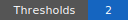
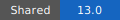
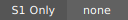
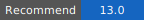

# Counterpoint Threshold Frontier Probe









This repository directory is the human-readable readout surface for the threshold-frontier probe. The probe reruns the corrected Schema 0 versus Schema 1 comparison over a locked reward-threshold grid while holding candidate, seed policy, and small budget fixed.

## Status At A Glance

- Artifact evidence: `complete`.
- Run mode: `threshold_frontier_probe_v001`.
- Instance: `counterpoint_symbolic_n3_wide_20_108_span18_v001`.
- Threshold count: `2`.
- Pair rows: `2`.
- Claim status: `schema1_margin_advantage_only`.
- Recommended paired-replicate threshold: `13.0`.

## Liftability And Invariant Semantics

- Liftability semantics: `state_collapser_v072_pointwise`.
- Runtime action availability is pointwise: an abstract action must have a concrete lift executable from the current base state.

## Summary of Goals Behind this Evaluation

The goal is to locate the sustained-hit threshold frontier for Schema 0 and Schema 1 under one corrected widened candidate. This is a next-measure probe, not a final serious comparison.

## Summary of Methodology Behind this Evaluation

For each threshold value, the runner executes the existing corrected second-serious schema comparison under matched candidate, seed, budget, and persistence settings. The frontier layer then promotes each threshold's arm, pair, tower, lift, and timing evidence into top-level frontier tables.

## Frontier Summary

| highest_shared_passing_threshold | highest_schema0_passing_threshold | highest_schema1_passing_threshold | schema1_only_passing_thresholds | recommended_replicate_probe_threshold | claim_status |
| --- | --- | --- | --- | --- | --- |
| 13.0 | 13.0 | 13.0 |  | 13.0 | schema1_margin_advantage_only |

## First Failure By Schema

| schema_class_id | first_failure_threshold | highest_passing_threshold | frontier_classification |
| --- | --- | --- | --- |
| schema0_no_contraction |  | 13.0 | no_failure_observed |
| schema1_noisy_rate_one_drop |  | 13.0 | no_failure_observed |

## Threshold Arm Rows

| threshold_value | schema_class_id | sustained_hit_count | run_count | sustained_hit_rate | post_hit_window_mean | threshold_margin_mean | passes_frontier_threshold |
| --- | --- | --- | --- | --- | --- | --- | --- |
| 12.0 | schema0_no_contraction | 1 | 1 | 1.0 | 13.368636363636364 | 1.368636363636364 | True |
| 12.0 | schema1_noisy_rate_one_drop | 1 | 1 | 1.0 | 13.550757575757576 | 1.5507575757575758 | True |
| 13.0 | schema0_no_contraction | 1 | 1 | 1.0 | 13.368636363636364 | 0.3686363636363641 | True |
| 13.0 | schema1_noisy_rate_one_drop | 1 | 1 | 1.0 | 13.550757575757576 | 0.5507575757575758 | True |

## Paired Threshold Rows

| threshold_value | schema0_hit_status | schema1_hit_status | schema1_minus_schema0_episodes_to_hit | schema1_minus_schema0_post_hit_window_mean | pair_status | claim_blocked |
| --- | --- | --- | --- | --- | --- | --- |
| 12.0 | sustained_hit | sustained_hit | 0.0 | 0.18212121212121168 | schema1_margin_higher | False |
| 13.0 | sustained_hit | sustained_hit | 0.0 | 0.18212121212121168 | schema1_margin_higher | False |

## Claim Boundary

This readout may support only a bounded single-candidate threshold-frontier interpretation. It may not claim broad abstraction superiority, statistical significance, tensor-enabled behavior, or musical quality.

To regenerate the human-readable readout, run:

```text
execute docs/prime_directive/artifact_table_to_readable_document_protocol.md at /Users/foster/big_boy_benchmarking/docs/evaluations/counterpoint_symbolic_v001/threshold_frontier_probe/readout_source.json
```

Source artifact root:

```text
/Users/foster/big_boy_benchmarking/docs/evaluations/counterpoint_symbolic_v001/threshold_frontier_probe/artifacts/episodes16_001
```

## Clarifying Questions And Turns

#### Evaluator Turn

Tell me everything you can about the read badge here.

#### Codex Turn

The red badge is the `Frontier` badge:

```text
Frontier: frontier_blocked_by_artifacts
```

This is the top-level claim-status badge for the threshold-frontier probe. It does not mean the repository artifact tree is missing or corrupt. The artifact status is separately `complete`, liftability is separately `state_collapser_v072_pointwise`, and lift failures are separately `0`. Here, `frontier_blocked_by_artifacts` means that the generated evidence tables do not contain any claim-bearing threshold rows from which a frontier can be inferred.

The concrete reason is visible in the threshold rows. This smoke run tested two thresholds, `12.0` and `13.0`. At both thresholds, both arms have sustained-hit count `0`, sustained-hit rate `0.0`, and `passes_frontier_threshold = False`. The paired rows also show both threshold pairs as `blocked_or_non_sustained`, with both Schema 0 and Schema 1 recorded as `transient_hit_only`. So the frontier layer has no passing threshold for Schema 0, no passing threshold for Schema 1, no shared passing threshold, and no Schema-1-only passing threshold.

That makes the red badge different from a negative scientific result. It is not saying "Schema 1 failed the frontier test" in a stable way. It is saying "this particular smoke artifact cannot support a frontier claim." The strongest interpretation is that the machinery ran, the nested threshold-local second-serious comparisons were harvested, and the readout correctly refused to promote a frontier conclusion.

The recommended threshold `13.0` should be read carefully in that context. It is a blue operational recommendation for the next paired-replicate probe, not evidence that `13.0` passed here. In this smoke root, `13.0` is recommended despite the red frontier badge because the frontier probe's job includes selecting a practical next threshold even when the claim itself is blocked.

My current read: the red badge is doing useful guardrail work. It tells us this artifact root is good for validating the threshold-frontier pipeline and its human-readable summaries, but not for making a threshold-frontier claim. To turn this into claim-bearing evidence, we need a non-smoke run with enough episode budget for the sustained-hit persistence rule and enough paired threshold rows for passing/failing behavior to actually separate.

#### Evaluator Turn

_Open._

#### Codex Turn

_Open._

#### Evaluator Turn

_Open._

#### Codex Turn

_Open._

#### Evaluator Turn

_Open._

#### Codex Turn

_Open._

#### Evaluator Turn

_Open._

#### Codex Turn

_Open._
