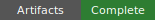
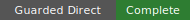
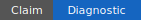

# PlateSupport Direct-Star Cul-de-sac Control - Guarded Diagnostic Readout

     

## Status At A Glance

- Artifact evidence: complete; required arm, guard, step, lift, tier, timing, and interpretation tables exist.
- Behavioral result: diagnostic control result; tower beats raw direct on binary target, but guarded direct controls beat tower.
- Goal result: the run identifies one-step validity/self-loop filtering as a major confound in the prior PlateSupport signal.
- Claim scope: diagnostic smoke/calibration evidence only; this is not a final robotics benchmark claim.
- Provenance: repo-resident artifact root under `docs/evaluations/plate_support_5x5_default_v001/direct_star_culdesac_control/artifacts/guarded_001`.

## Summary of Goals Behind this Evaluation

This evaluation exists because Abdul Malik, project PM, observed that the previous PlateSupport gauntlet result raised an action-surface concern: raw direct learning appeared to hit invalid or self-looping cul-de-sacs, while the tower controller avoided them through its liftability/executable-action machinery. The Project Owner accepted that concern and asked for a BBB-side diagnostic control rather than treating the prior tower-positive signal as settled.

The concrete question is whether the selected PlateSupport iterated tower candidate still looks better when direct learning receives one-step local guards. The arms are `direct_raw`, `direct_invalid_guard`, `direct_nonself_guard`, and `tower_selected_candidate`. The evaluation is not trying to prove broad robotics superiority, perfect direct/tower fairness, or final benchmark significance.

## Summary of Methodology Behind this Evaluation

The run label is `guarded_001`. The calibrated target is `plate_support_binary_goal_success_v001` with `32` episodes per replicate and `4` replicates per arm. All arms use matched paired seed bundles.

Direct arms use tabular Q-learning over the primitive PlateSupport action alphabet, with epsilon-greedy selection and guard-specific Q bootstrap. The guards are applied before action selection. `direct_invalid_guard` removes only actions whose one-step primitive transition is marked invalid. `direct_nonself_guard` removes actions whose one-step primitive transition returns to the same concrete state. If a guard ever filters all actions, the episode is diagnostically blocked rather than silently falling back to raw direct behavior.

The selected tower arm reuses the parent gauntlet's selected iterated source-local-ratio candidate and does not receive direct-style guard masks. Aggregation compares binary target-hit rate, mean reward, invalid moves, self-transitions, guard-filter counts, and action-surface counts.

## One-Screen Verdict

The diagnostic completed and materially changes how the prior PlateSupport result should be read. The tower arm beats raw direct on the binary target: `0.1953125` versus `0.1171875`. However, both guarded direct controls beat the tower: `direct_invalid_guard=0.359375` and `direct_nonself_guard=0.515625`.

The interpretation is `validity_filtering_explains_signal`. Allowed claim: ordinary one-step validity filtering explains most of the original tower signal. Blocked claim: tower hierarchy beat direct learning on an equivalent decision surface.

This is a useful negative-control result. It does not say the tower machinery is useless; it says the specific earlier PlateSupport advantage is not yet separated from one-step local action filtering.

## Key Arm Results

| Arm | Target Hit Rate | Mean Reward | Invalid Rate | Self-Transition Rate | Mean Available Actions |
| --- | ---: | ---: | ---: | ---: | ---: |
| `direct_raw` | 0.1171875 | -78.71875 | 0.3559913578195114 | 0.4631876350340701 | 12.0 |
| `direct_invalid_guard` | 0.359375 | -17.1640625 | 0.0 | 0.16553199766582377 | 7.155611748687026 |
| `direct_nonself_guard` | 0.515625 | 18.78125 | 0.0 | 0.0 | 5.483341154387611 |
| `tower_selected_candidate` | 0.1953125 | -27.2109375 | 0.0 | 0.0 | 5.373002663115845 |

## Guard And Action-Surface Findings

- Raw direct saw `12.0` primitive actions before guard and made `2142` invalid moves.
- Invalid-guarded direct filtered `4.844388251312974` invalid actions on average and made zero invalid moves.
- Nonself-guarded direct filtered `6.516658845612389` self-loop actions on average and made zero self-transitions.
- The tower arm had `5.373002663115845` executable action cells on average and also made zero invalid moves.
- The tower versus nonself-guard target delta was `-0.3203125`, so the tower did not survive the strictest one-step direct control in this run.

## Information Parity Warning

The guarded direct controls use oracle one-step local transition masks. They diagnose invalid/self-loop filtering, but they do not prove perfect action-surface parity with the tower. In particular, `direct_nonself_guard` is a control arm, not a final fairness theorem.

## Run Identity

- Evaluation id: `plate_support_direct_star_culdesac_control_v001`
- Environment family: `plate_support`
- Environment instance: `plate_support_5x5_default_v001`
- Run label: `guarded_001`
- Source artifact root: `docs/evaluations/plate_support_5x5_default_v001/direct_star_culdesac_control/artifacts/guarded_001`
- Source evaluation root: `docs/evaluations/plate_support_5x5_default_v001/direct_star_culdesac_control/artifacts/guarded_001/evaluations/plate_support_direct_star_culdesac_control_v001`
- Budget lock: `artifacts/guarded_001/evaluations/plate_support_direct_star_culdesac_control_v001/evaluation_budget_lock.json`
- Parent gauntlet source: `docs/evaluations/plate_support_5x5_default_v001/standard_gauntlet/readout_source.json`

## Claim Boundary

- This readout may claim that one-step guarded direct controls were implemented and completed under matched seeds.
- This readout may claim that the guarded controls explain or exceed the prior raw-direct tower signal in this run.
- This readout may not claim broad tower superiority, broad tower failure, or final robotics benchmark significance.
- This readout may not call `direct_nonself_guard` a perfectly fair direct baseline without qualification.

## Inspection Map

- Main arm table: `artifacts/guarded_001/evaluations/plate_support_direct_star_culdesac_control_v001/results/arm_summary.csv`
- Guard filtering table: `artifacts/guarded_001/evaluations/plate_support_direct_star_culdesac_control_v001/results/guard_filter_summary.csv`
- Paired guard comparisons: `artifacts/guarded_001/evaluations/plate_support_direct_star_culdesac_control_v001/results/paired_guard_comparison.csv`
- Action surface table: `artifacts/guarded_001/evaluations/plate_support_direct_star_culdesac_control_v001/results/action_surface_summary.csv`
- Interpretation table: `artifacts/guarded_001/evaluations/plate_support_direct_star_culdesac_control_v001/results/interpretation_summary.csv`

## Clarifying Questions And Turns

#### Project Owner / Evaluator Turn
> Right. So now maybe this other thing I was trying to ask will become more clear: We fixed the direct star, *but* the only loop prevention currently in tower is in lifts, yes? The actual omparision needs to "star" both. Does this make sense?

#### Embedded Engineering Consultant / Codex Turn

> Yes, this makes sense, and I think it sharpens the next comparison.
>
> The current diagnostic "stars" direct, but it does not explicitly "star" tower in the same primitive-action sense. The tower arm currently acts through executable quotient action cells backed by concrete lift candidates. That means tower action availability is already filtered by liftability/executability, and in this run the selected tower actions produced zero invalid moves and zero self-transitions. But that is not the same statement as saying: "after choosing the tower action surface, apply the same one-step primitive nonself/validity guard to the concrete lift set."
>
> So the fair next design is probably not just `direct_raw` versus `direct_nonself_guard` versus the current tower. It should include tower-star variants. The relevant arms would be something like:
>
> - `direct_raw`;
> - `direct_invalid_guard`;
> - `direct_nonself_guard`;
> - `tower_lift_executable_current`;
> - `tower_invalid_guard`;
> - `tower_nonself_guard`.
>
> The key implementation distinction is that tower-star should filter at the concrete lift-candidate level, not by post-hoc veto after a tower action has already been selected. A tower action cell should be available under `tower_nonself_guard` only if it has at least one executable concrete lift whose primitive transition is nonself. Then the selected concrete lift should come from that guarded lift pool. If the guard removes all lifts from an action cell, the cell disappears from the tower action surface for that arm.
>
> This would let us answer a cleaner question: does hierarchy help after both sides are normalized against the same local cul-de-sac / self-loop mechanism? The current result says direct-star beats the current tower. The next result should tell us whether that remains true when tower is also explicitly starred, and whether the tower's liftability filter was doing something narrower, broader, or just different from direct one-step nonself filtering.
>
> One important caution: the fact that the current tower had zero selected invalid/self transitions does not make tower-star redundant. It only says the selected concrete actions were clean in this run. It does not tell us whether the available tower action cells contained mixed lift pools, whether some action cells were only executable through self-loop lifts, or whether the representative-lift rule hid differences that a true tower-star arm should expose. The next design should record those counts directly.

#### Project Owner / Evaluator Turn

> Call this `tower_star` and create new folder for it in design. Create blueprint in there. Extremeley detailed.

#### Embedded Engineering Consultant / Codex Turn

> Done. I created the `tower_star` design folder and blueprint here:
>
> `docs/design/first_plate_support_environment/standard_gauntlet_suite/10_tower_star/01_001_plate_support_tower_star_guarded_lift_comparison_blueprint.md`
>
> I treated `tower_star` as the next diagnostic block after direct-star: direct-star filters primitive direct actions, while tower-star should filter concrete lift candidates inside quotient action cells before the tower chooses among those cells. That keeps the comparison focused on your actual question: after direct and tower are both normalized against the same one-step invalid/self-loop mechanism, does the tower signal survive?
>
> I also locked attribution in the blueprint. Abdul Malik gets attribution for the original cul-de-sac concern; you get attribution for requesting the `tower_star` follow-up here; the concrete arm matrix, artifact contract, and stop conditions are marked as Codex-authored engineering recommendations unless you accept or revise them.

#### Project Owner / Evaluator Turn

> ...

#### Embedded Engineering Consultant / Codex Turn

> ...
