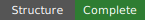
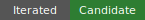

# PlateSupport Standard Gauntlet

## Result

Stages 1-7 completed. Stage 6 produced bounded paired comparison status `paired_comparison_positive_signal`, and Stage 7 produced the human readout/system-learning surface.

Under this smoke Stage 6 budget, the selected tower candidate shows a limited positive target-hit signal relative to the direct baseline.

The target metric is Stage 5 binary goal success. Other metrics can explain the run, but they do not reverse the Stage 6 target claim.

## Key Numbers

- Valid states: `89`
- Shortest path length: `6`
- Random-policy success rate: `0.024`
- Stage 6 counter-signal: Tower mean reward was -27.2109375 versus direct -78.71875; tower invalid moves were 0 versus direct 2142.

## Stage Status

| Stage | Name | Status | Claim Status |
| --- | --- | --- | --- |
| 1 | structural_and_tower_diagnostics | complete | diagnostic_complete |
| 2 | contraction_schema_sweep | complete | diagnostic_complete |
| 3 | candidate_discovery | complete | candidate_found |
| 4 | tower_training_health | complete | trainable_clean |
| 5 | threshold_frontier_calibration | complete | threshold_calibrated |
| 6 | paired_replicate_comparison | complete | paired_comparison_positive_signal |
| 7 | readout_and_system_learning | complete | readout_complete |

## Artifact Provenance

- Readout source: `<repo-root>/docs/evaluations/plate_support_5x5_default_v001/standard_gauntlet/readout_source.json`
- Raw artifact root: `<repo-root>/docs/evaluations/plate_support_5x5_default_v001/standard_gauntlet/artifacts/iterated_001`
- Suite evaluation root: `<repo-root>/docs/evaluations/plate_support_5x5_default_v001/standard_gauntlet/artifacts/iterated_001/evaluations/plate_support_standard_gauntlet_v001`

## Claim Boundary

bounded paired smoke comparison under the Stage 5 target and budget; not a general tower-performance claim

## Clarifying Turns

###  PO Turn
> Tell mne what this means: 
>   `Stage 6 counter-signal: Tower mean reward was -27.2109375 versus direct -78.71875; tower invalid moves were 0 versus direct 2142.`

### Codex Turn
That line is reporting a secondary Stage 6 signal, not the formal target metric itself.
The formal Stage 6 claim is the binary goal-success target from Stage 5: the tower
candidate hit the target 25 times out of 128 episodes, while the direct concrete
baseline hit it 15 times out of 128 episodes. That is why the report says
`paired_comparison_positive_signal`.

The counter-signal line is saying that the surrounding behavioral evidence points in
the same direction:

- Mean total reward is better for the tower arm: `-27.2109375` versus `-78.71875`.
  In this environment, rewards are mostly penalties plus goal-success benefit, so
  "less negative" is better. The tower arm is losing much less reward per episode.
- Invalid concrete moves are dramatically different: tower has `0`, direct has
  `2142`.
- The direct arm took `6017` concrete steps total, so `2142` invalid moves is an
  invalid-move rate of about `35.6%`.
- The tower arm took `6008` concrete steps total with `0` invalid moves.

So the concrete interpretation is: the selected iterated tower candidate is not just
barely beating the direct baseline on the locked binary target. It is also behaving
more cleanly. The direct baseline spends a lot of its budget attempting illegal
actions, while the tower-selected controller is being routed through an abstraction
that effectively avoids those invalid concrete attempts.

One subtlety: the mean episode lengths are almost the same, `46.94` steps for tower
versus `47.01` for direct. So the reward gap is not mostly because tower episodes are
much shorter. It is mostly because the tower arm wastes fewer steps on invalid moves
and reaches the goal more often. Another way to see that is mean concrete steps per
target hit: tower is about `240.32`, while direct is about `401.13`.

I would read this as a small but coherent first PlateSupport positive signal. It is
still bounded by the smoke budget, one selected candidate, four matched replicate
pairs, and the Stage 5 binary target. But within that boundary, the result is not a
weird one-column artifact: target hits, mean reward, invalid moves, and steps per hit
all make the same basic story plausible.
