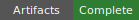
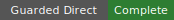
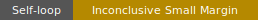
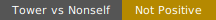
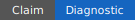

# PlateSupport Tower-Star Guarded Lift Comparison Readout

     

## Status At A Glance

- Artifact evidence: complete; the required run and summary tables exist in the repo-resident artifact root.
- Run label: `tower_star_001`.
- Primary interpretation: `inconclusive_small_margin`.
- Primary comparison: `direct_nonself_guard` versus `tower_nonself_guard`.
- Claim scope: diagnostic smoke/calibration evidence only.

## Summary of Goals Behind this Evaluation

This evaluation follows Abdul Malik's PlateSupport cul-de-sac observation and the Project Owner's later clarification that direct-star alone is not enough: the tower side should also be explicitly starred. The purpose is to test whether the selected PlateSupport tower candidate still carries signal when direct and tower are both normalized against one-step local invalid/self-loop mechanisms.

## Summary of Methodology Behind this Evaluation

Direct-star filters primitive actions before direct action selection. Tower-star filters concrete lift candidates inside quotient action cells before tower action-cell selection. If a tower action cell has no surviving guarded lift candidates, that action cell is removed from the tower action surface for that arm.

The six arms are:

- `direct_raw`;
- `direct_invalid_guard`;
- `direct_nonself_guard`;
- `tower_lift_executable_current`;
- `tower_invalid_guard`;
- `tower_nonself_guard`.

## One-Screen Verdict

The primary target delta (`tower_nonself_guard - direct_nonself_guard`) is `0.0`.
`direct_nonself_guard` target-hit rate: `0.0`.
`tower_nonself_guard` target-hit rate: `0.0`.
`tower_lift_executable_current` target-hit rate: `0.0`.

## Key Arm Results

| Arm | Target Hit Rate | Mean Reward | Invalid Rate | Self-Transition Rate | Blocked Episodes |
| --- | ---: | ---: | ---: | ---: | ---: |
| `direct_raw` | 0.0 | -97.0 | 0.44 | 0.47 | 0 |
| `direct_invalid_guard` | 0.0 | -61.0 | 0.0 | 0.11 | 0 |
| `direct_nonself_guard` | 0.0 | -50.0 | 0.0 | 0.0 | 0 |
| `tower_lift_executable_current` | 0.0 | -50.0 | 0.0 | 0.0 | 0 |
| `tower_invalid_guard` | 0.0 | -50.0 | 0.0 | 0.0 | 0 |
| `tower_nonself_guard` | 0.0 | -50.0 | 0.0 | 0.0 | 0 |

## Direct-Star Versus Tower-Star Comparisons

| Comparison | Left Arm | Right Arm | Delta Right Minus Left | Flag |
| --- | --- | --- | ---: | --- |
| `direct_raw_vs_tower_current` | `direct_raw` | `tower_lift_executable_current` | 0.0 | `arms_tied` |
| `direct_invalid_vs_tower_invalid` | `direct_invalid_guard` | `tower_invalid_guard` | 0.0 | `arms_tied` |
| `direct_nonself_vs_tower_nonself` | `direct_nonself_guard` | `tower_nonself_guard` | 0.0 | `primary_pair_tied` |
| `tower_current_vs_tower_invalid` | `tower_lift_executable_current` | `tower_invalid_guard` | 0.0 | `arms_tied` |
| `tower_current_vs_tower_nonself` | `tower_lift_executable_current` | `tower_nonself_guard` | 0.0 | `arms_tied` |
| `direct_invalid_vs_direct_nonself` | `direct_invalid_guard` | `direct_nonself_guard` | 0.0 | `arms_tied` |
| `tower_invalid_vs_tower_nonself` | `tower_invalid_guard` | `tower_nonself_guard` | 0.0 | `arms_tied` |

## Tower Action-Cell And Lift-Pool Findings

- Surface summary rows: `15`; lift-pool mixing summary rows: `15`.
- Inspect `tower_lift_guard_summary.csv`, `tower_action_cell_surface_summary.csv`, and `lift_pool_mixing_summary.csv` to see which action cells were removed by invalid-star or nonself-star filtering.

## Information Parity Warning

Both direct-star and tower-star use oracle one-step local transition information. This is a diagnostic control for the cul-de-sac confound, not a final proof of deployable direct/tower fairness.

## Attribution

- Abdul Malik, project PM, raised the original cul-de-sac / validity-filtering concern.
- The Project Owner requested the `tower_star` follow-up and the detailed implementation workplan.
- Codex authored the concrete arm matrix, artifact contract, and implementation details unless revised by the Project Owner.

## Claim Boundary

- This readout may compare direct-star and tower-star diagnostic controls.
- This readout may not claim broad tower superiority or broad tower failure.
- This readout may not claim final robotics benchmark significance.

## Inspection Map

- Main arm table: `artifacts/tower_star_001/evaluations/plate_support_tower_star_guarded_lift_comparison_v001/results/arm_summary.csv`
- Star comparisons: `artifacts/tower_star_001/evaluations/plate_support_tower_star_guarded_lift_comparison_v001/results/paired_star_comparison.csv`
- Tower lift table: `artifacts/tower_star_001/evaluations/plate_support_tower_star_guarded_lift_comparison_v001/results/tower_lift_guard_summary.csv`
- Interpretation table: `artifacts/tower_star_001/evaluations/plate_support_tower_star_guarded_lift_comparison_v001/results/interpretation_summary.csv`

## Clarifying Questions And Turns

#### Project Owner / Evaluator Turn

> Am I reading the table under "Key Arm Results" correctly? It looks like it says tower is better on reward at least as average.

#### Embedded Engineering Consultant / Codex Turn

> Yes, but with an important comparison caveat.
>
> In the table, the tower arms have better mean reward than `direct_raw` and `direct_invalid_guard`: `-50.0` is less negative than `-97.0` and `-61.0`, so under this reward convention it is better. But the strongest fairness-relevant direct-star control in this readout is `direct_nonself_guard`, and that arm also has mean reward `-50.0`. So the reward table says: tower looks better than raw direct and invalid-guard direct, but it does not beat the nonself guarded direct control in this smoke run.
>
> That is why the readout marks the primary interpretation as `inconclusive_small_margin` and the primary target comparison as tied. The result is still useful: it shows that once direct gets the one-step nonself cul-de-sac filter Abdul asked us to test, the first smoke-level tower-star comparison no longer separates tower from direct on either target-hit rate or mean reward. It does not say tower is worse; it says this particular control makes the earlier reward advantage non-diagnostic.

#### Project Owner / Evaluator Turn

> Which way does the "inconclusive small margin" inconclusively point?

#### Embedded Engineering Consultant / Codex Turn

> It inconclusively points away from the stronger positive tower claim, and toward the cul-de-sac/control explanation, at least in this tiny smoke run.
>
> More precisely: on the primary target metric, it does not point either way. `direct_nonself_guard` and `tower_nonself_guard` are exactly tied: target-hit rate `0.0` versus `0.0`, with primary target delta `0.0`. So if we ask the narrow question "does tower-star beat direct-star on the calibrated binary target here?", the answer is no evidence either way.
>
> But the surrounding reward/action evidence does have a direction. Raw direct is bad (`-97.0` mean reward, 44 invalid moves, 47 self transitions). Invalid-guard direct improves (`-61.0`, no invalid moves, 11 self transitions). Nonself-guard direct reaches the same visible profile as the tower arms (`-50.0`, no invalid moves, no self transitions). That pattern points toward Abdul's concern being live: the original tower advantage may have been partly or entirely explained by local action filtering / cul-de-sac avoidance, not by a specifically tower-only learning advantage.
>
> So I would phrase the direction like this: the result is neutral on the primary success target, but diagnostically it leans toward "the direct baseline was under-controlled" rather than "tower has survived the strongest local-control challenge." It does not refute tower; it tells us the next evaluation has to be sharper or larger if we want to recover a tower-specific signal.
