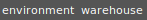
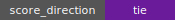
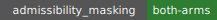
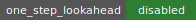
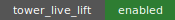
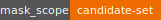
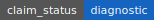
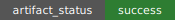

# Warehouse Gridlock Masked Direct vs Live-Lift Tower

       

## Result

Score direction is tie: mean reward direct=-30.5, tower=-30.5 under the checked budget.

Run label: `smoke_001`.

This is diagnostic evidence only. It compares `warehouse_direct_admissible_masked` against
`warehouse_tower_live_lift_masked` under immediate inadmissibility masking for both arms.

## Fairness Boundary

Both arms use immediate inadmissibility masks over generated candidate sets.
Neither arm uses one-step successor-state cul-de-sac lookahead.

This evaluation does not implement Abdul-style direct* or tower* one-hop
cul-de-sac guards. Successor-state Out may be recorded for diagnosis, but it is
not used for action selection.

Tower live lifting is a state-lift hygiene rule. It prevents selecting an
already-dead upstairs representative for a fixed downstairs state. It is not a
single-tier action-successor lookahead rule.

## Scope

The Warehouse full primitive action surface is `5^32`, so this evaluation does
not enumerate the full action space. Direct and tower masks are exact over
their generated candidate sets unless a future run explicitly proves a larger
surface.

## Key Files

- `readout_source.json`
- `result_readout.md`
- `method.md`
- `results/score_readout.md`
- `results/fairness_audit.md`
- `results/tower_construction_readout.md`

## Clarifying Conversation

### Evaluator Turn

Add questions or concerns about this generated readout here.

### Codex Turn

Pending.
