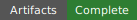
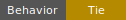
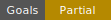
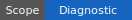
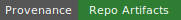

# Warehouse Gridlock Masked Direct vs Live-Lift Tower - Human Readout

    

## Status At A Glance

- Artifact evidence: complete for the required source binding; the expected manifests, run index, aggregate tables, mask summaries, candidate-family summary, live-lift summary, and progress log are present under the resolved artifact root.
- Behavioral result: tied; the direct and tower arms produced identical aggregate rewards, target progress, terminal-success counts, selected-step counts, and paired deltas under this small diagnostic budget.
- Goal result: partially met; the run validates the fairness surface, no-lookahead audit, live-lift hygiene, and coordination-ready proposal surface, but it does not show a tower advantage or solve the Warehouse task.
- Claim scope: diagnostic pilot; this is a bounded 8-episode-per-replicate run, not a final benchmark or broad tower-superiority result.
- Provenance: repo-resident artifacts; the source binding points to `docs/evaluations/warehouse_gridlock_001/masked_direct_vs_live_lift_tower/artifacts/masked_8ep_001`.

## Summary of Goals Behind this Evaluation

This evaluation asks whether the Warehouse Gridlock environment can support a fair first comparison between a direct concrete controller and a tower controller when both arms are protected from impossible moves in the same immediate way. The environment is the PO-designed `warehouse_gridlock_16x16_v001` fixture: many robots and boxes must coordinate on a finite grid with blocked columns and synchronous one-second moves.

The direct arm is `warehouse_direct_admissible_masked`. It acts on generated concrete ensemble actions after an immediate inadmissibility mask removes actions that cannot legally execute in the current state.

The tower arm is `warehouse_tower_live_lift_masked`. It uses the same bounded generated proposal surface, but builds a scoped generated/discovered tower surface and applies live state-lift hygiene: after a downstairs state is fixed, it does not lift to an upstairs representative with empty generated `Out`.

The goal is not to give either arm Abdul's stronger one-hop cul-de-sac lookahead. Neither arm may select an action by checking whether the successor state has outgoing actions. The goal is also not to prove broad robotics performance, full-MDP coverage, or general tower superiority. This run exists to check whether the comparison surface is coherent enough to justify longer runs.

## Summary of Methodology Behind this Evaluation

The run label is `masked_8ep_001`. The locked budget used 8 episodes per arm per replicate, 2 replicates per arm, 1 schema seed, a 128-second episode horizon, 256 generated candidate proposals per step, and `max_active_robots=8`. The candidate mix was `coordination_ready_sparse_interleaved_v001`, which means the bounded proposal surface included all-stay, one-active, two-active, three-active, and larger multi-active robot ensembles instead of spending the early budget only on one-robot moves.

Both arms used immediate candidate-set masks. Those masks are exact over the generated candidate set, not over the full primitive action space. The full Warehouse action surface is `5^32`, so the evaluation explicitly does not enumerate all possible ensemble actions.

The tower surface was a scoped generated/discovered surface, not a complete Warehouse MDP tower. At each tower step, BBB generated concrete candidates, queried immediate Warehouse transitions, retained valid edges, and built a two-tier runtime surface over those generated edges. The source binding classifies full action-space enumeration as not applicable.

The evaluation was run and then summarized into repo-side artifacts. The human-readable report was generated from `readout_source.json` using `docs/prime_directive/artifact_table_to_readable_document_protocol.md`.

## One-Screen Verdict

The run completed cleanly and the fairness checks passed. Both arms selected 2048 valid concrete steps in aggregate, selected zero invalid concrete moves, and never used successor-state `Out` for action selection. The tower arm had no live-lift failures.

The behavioral result is a complete tie. Direct and tower both had mean total reward `379.9375`, median total reward `341.5`, zero terminal successes, zero final correct boxes, mean final correct robots `6.1875`, and 128 selected valid steps per episode.

This is useful diagnostic evidence: the candidate surface is now coordination-ready and the fairness/no-lookahead audits pass. It is not evidence that the tower is better. The run is too small and too tied to support a positive tower-performance claim.

## Run Identity

| Field | Value |
| --- | --- |
| Evaluation id | `warehouse_gridlock_masked_direct_vs_live_lift_tower_no_lookahead_v001` |
| Environment instance | `warehouse_gridlock_16x16_v001` |
| Run label | `masked_8ep_001` |
| Repo readout surface | `docs/evaluations/warehouse_gridlock_001/masked_direct_vs_live_lift_tower` |
| Source artifact root | `docs/evaluations/warehouse_gridlock_001/masked_direct_vs_live_lift_tower/artifacts/masked_8ep_001` |
| Source evaluation root | `docs/evaluations/warehouse_gridlock_001/masked_direct_vs_live_lift_tower/artifacts/masked_8ep_001` |
| Artifact schema | `v1` / `bbb.v001` |
| Episodes | 8 per arm per replicate |
| Replicates | 2 per arm |
| Schema seeds | 1 |
| Horizon | 128 seconds per episode |
| Candidate proposals | 256 per step |
| Max active robots in proposal generator | 8 |
| Candidate mix | `coordination_ready_sparse_interleaved_v001` |
| Progress log | `artifacts/masked_8ep_001/progress_events.jsonl` |

## Claim Boundary

This report may claim that the diagnostic artifact set is complete, both active arms were run under equal immediate candidate-set masking, neither arm used one-step successor `Out` for action selection, the tower live-lift hygiene check had no failures, and the candidate surface exposed multi-robot proposals.

This report may not claim tower advantage, statistical significance, broad robotics performance, full-MDP tower coverage, or success of the Warehouse task. It also does not evaluate Abdul-style direct-star or tower-star one-hop cul-de-sac controls.

## Arm Legend

| Arm id | Reader label | Method class | Interpretation |
| --- | --- | --- | --- |
| `warehouse_direct_admissible_masked` | Direct masked control | Concrete controller over generated ensemble actions with immediate inadmissibility masking | Baseline arm; it should not waste budget on impossible moves, but it receives no successor-state cul-de-sac lookahead. |
| `warehouse_tower_live_lift_masked` | Tower live-lift control | Scoped generated/discovered tower controller with immediate action masking and live state-lift hygiene | Tower arm; it receives no one-hop action-successor lookahead, but avoids lifting a fixed downstairs state to an upstairs representative with empty generated `Out`. |

## Main Result Table

| Arm | Artifact status | Behavioral status | Mean reward | Delta vs direct | Episodes | Terminal successes | Mean final boxes | Mean final robots | Mean selected valid steps | Main warning | Evidence |
| --- | --- | --- | ---: | ---: | ---: | ---: | ---: | ---: | ---: | --- | --- |
| Direct masked control | Complete | Ran, no terminal success | 379.9375 | 0.0 | 16 | 0 | 0.0 | 6.1875 | 128.0 | No boxes reached target; pilot budget only. | `results/arm_summary.csv` |
| Tower live-lift control | Complete | Ran, no terminal success | 379.9375 | 0.0 | 16 | 0 | 0.0 | 6.1875 | 128.0 | Identical aggregate behavior; no advantage shown. | `results/arm_summary.csv` |

## Diagnostic Findings

### 1. The Run Is A Clean Tie

All 16 paired episode comparisons had zero reward delta, zero box-progress delta, zero robot-progress delta, zero terminal-success delta, zero valid-step delta, zero candidate-count delta, and zero query-count delta. This means the current controller/tower surface produced identical aggregate behavior for the direct and tower arms under the small 8-episode budget.

### 2. The Fairness Surface Passed

Both arms used candidate-set immediate masking. Each arm considered `524288` candidates before masking, retained `40797` after masking, and rejected `483491` generated candidates as inadmissible. Each arm performed `524288` admissibility queries. Neither arm selected invalid concrete moves.

### 3. No One-Hop Cul-De-Sac Lookahead Was Used

The no-lookahead audit reports `successor_out_count_used_for_selection_count=0` for both arms across `2048` selected steps per arm. Successor `Out` was observed for diagnosis only; it was not used to select actions.

### 4. The Candidate Surface Is Coordination-Ready

The candidate family summary confirms that the generated direct proposal set included one-active, two-active, three-active, and larger multi-active robot moves up to active count 8. This fixes the earlier smoke weakness where the bounded budget mostly exposed one-active moves.

One caveat: `candidate_family_summary.csv` is currently derived from direct candidate event rows. The tower manifest records the same candidate mix and budget, and tower surface rows record the generated/discovered tower surface, but a future readout improvement could add a separate tower candidate-family summary.

### 5. Tower Live Lifting Worked, But The Tower Is Still Scoped

The tower live-lift table reports `2048` fiber candidates, `2048` live lift candidates, zero dead lift candidates, and zero live-lift failures. The mean selected lift out-count was `19.92041015625`.

The tower shape table shows a two-tier generated/discovered surface at each tower step. Tier 0 had mean action cells/valid edges `19.920`; tier 1 had mean action cells `10.160`; both tiers had one state cell in this scoped runtime representation. `complete_full_action_surface` is false throughout. This is a scoped runtime tower over generated candidates, not a full Warehouse MDP tower.

### 6. The Task Was Not Solved

Neither arm reached terminal success. Mean final correct boxes remained `0.0` for both arms. Mean final correct robots improved from `0.0` to `6.1875`, so the policies moved some robots into target positions, but they did not coordinate boxes to their targets in this short run.

## Timing Readout

| Arm/run | Runtime seconds |
| --- | ---: |
| Direct replicate 0 | 398.404 |
| Tower replicate 0 | 431.309 |
| Direct replicate 1 | 393.954 |
| Tower replicate 1 | 437.386 |
| Whole evaluation, from progress log | 1686.756 |

These are wall-clock run totals for the current Python/artifact implementation. They include candidate generation, transition queries, masking, tower-surface work, event accumulation, and artifact writing. They should not be used as a method-speed claim.

## Provenance Status

All required files listed in `readout_source.json` were present at generation time. The source binding marks full action-space enumeration as not applicable, which matches the Warehouse `5^32` action surface.

No required source artifact was classified as absent. The artifact root is repo-resident under the readout surface. Before public packaging or merge, verify whether raw artifact files are intended to be committed, ignored, or externalized as release assets.

## Evidence Map

| File | What it tells you |
| --- | --- |
| `readout_source.json` | Source binding for this generated readout. |
| `artifacts/masked_8ep_001/evaluation_budget_lock.json` | Locked run budget, seed policy, candidate policy, and progress settings. |
| `artifacts/masked_8ep_001/evaluation_aggregate_summary.json` | Machine summary: tie, fairness pass, no-lookahead pass, coordination-ready status. |
| `artifacts/masked_8ep_001/evaluation_aggregate_table.csv` | One-row aggregate status table. |
| `artifacts/masked_8ep_001/run_index.csv` | Four concrete runs: direct/tower across two replicates. |
| `artifacts/masked_8ep_001/results/arm_summary.csv` | Main arm-level reward, target, terminal, and mask aggregates. |
| `artifacts/masked_8ep_001/results/paired_summary.csv` | Episode-paired direct-vs-tower deltas. |
| `artifacts/masked_8ep_001/results/admissibility_query_summary.csv` | Candidate-set mask counts for both arms. |
| `artifacts/masked_8ep_001/results/candidate_family_summary.csv` | Generated proposal family counts and active-robot counts. |
| `artifacts/masked_8ep_001/results/no_lookahead_audit_summary.csv` | Whether successor `Out` was used for selection. |
| `artifacts/masked_8ep_001/results/tower_live_lift_summary.csv` | Live-lift candidate and failure counts. |
| `artifacts/masked_8ep_001/results/tower_shape_summary.csv` | Per-step scoped tower shape and action-cell counts. |
| `artifacts/masked_8ep_001/results/tower_surface_scope_summary.csv` | Generated/discovered surface scope, valid edges, invalid candidates, and full-surface flag. |
| `artifacts/masked_8ep_001/progress_events.jsonl` | Episode-level progress events and final duration. |

## Clarifying Questions And Turns

#### Project Owner / Evaluator Turn

> ...

#### Embedded Engineering Consultant / Codex Turn

> ...

#### Project Owner / Evaluator Turn

> ...

#### Embedded Engineering Consultant / Codex Turn

> ...

#### Project Owner / Evaluator Turn

> ...

#### Embedded Engineering Consultant / Codex Turn

> ...
